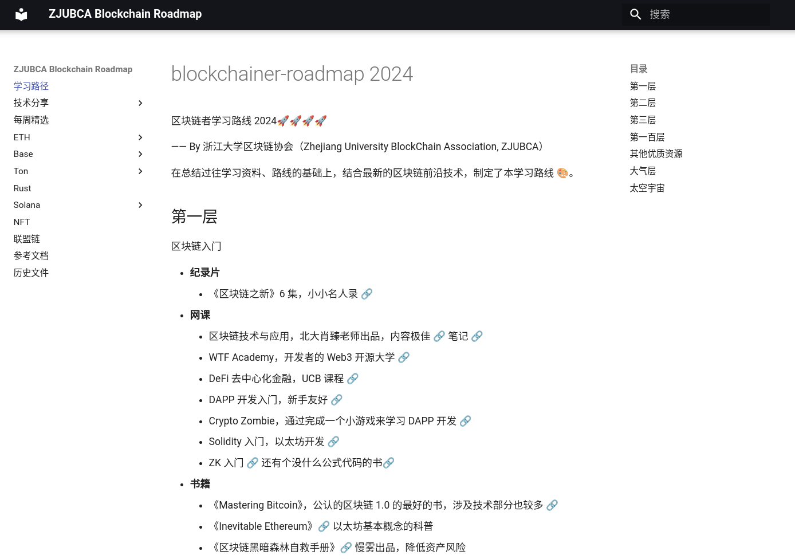

# ZJUBCA Blockchainer Roadmap

## Usage

欢迎访问：[zjubca.github.io/roadmap](https://zjubca.github.io/roadmap) 🥳

## Build

### Requirements

本项目需要安装 `Python` 和 `Nodejs`，执行 `pip install -r requirements.txt` 和 `npm install`。

### Run
运行`mkdocs serve`命令，打开浏览器输入网址[http://localhost:8000](http://localhost:8000)即可看到文档

### Format

执行 `npm format:prettier` 会 Format 全部文件，在 `git commit` 之前也会自动执行这条命令。

## How to contribute
参考[贡献文档](https://xdkkkgyt8c.feishu.cn/docx/LwWGdN209ofXfFxsVnQc0Q76nNc)

## Contributor

