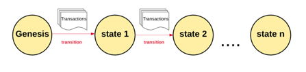

# Preliminary Study on ETH Dapp
  BY ZJUBCA

  We assume that you already have a basic understanding of blockchain. If you are new to terms like blockchain, smart contracts and Dapps, we deeply recommend that you read：[🔗ZJUBCA-Roadmap](../README.md)
## Technical Principles of Ethereum
### 一、What is Ethereum
Definitions of Ethereum vary, but in a nutshell, Ethereum is a "World Computer" based on state transitions (a computer that everyone can access and use, regardless of space constraints).

From a computer science perspective, Ethereum is a deterministic but unbounded transaction-driven "State Machine" (an organism that changes the information held by programme or system and maintains consensus) composed of globally accessible discrete individual states and virtual groups that apply changes to that state. From a more practical point of view, Ethereum is an open source, globally decentralized infrastructure capable of executing "Smart Contracts" (more on that below, which can be simply understood as code).

On the Ethereum platform, developers are able to build powerful decentralized applications with built-in economies. It uses blockchain to synchronize and store system state changes, and uses a cryptocurrency called "Ether" to measure and limit execution resource costs, providing high availability, auditability, transparency and neutrality

[🔗Ethereum White Paper](https://kauri.io/#collections/A%20Hackathon%20Survival%20Guide/ethereum-101-part-1-what-is-ethereum/)
### 二、In-depth Understanding of Ethereum
Maybe you are still a little confused about the concept of "State Machine" mentioned in the previous section. In order to make you more clearly understand the technical principles of Ethereum, this section will take the traditional Internet as the starting point and step by step to the underlying technical principles of Ethereum.

In computer terms, Ethereum is a kind of "Public Database" that holds permanent records of digital transactions. Importantly, the database does not require any middlemen to safeguard the interests of both parties. Instead, it works as a "No Trust" trading system, meaning you can conduct peer-to-peer transactions without the need for a third party.
<div align=center>

</div>

The Ethereum blockchain is essentially a state machine for transactions. In computer science, a state machine is something that reads a series of inputs and produces a new state based on those inputs.
<div align=center>

</div>
The Ethereum state machine starts with a "Genesis State," which is similar to a blank box before any transactions take place on the network. When the transaction is executed, this genesis-state transitions into some other states. At any time, it represents the current state of the Ethereum blockchain.

<div align=center>

</div>

There are millions of transactions running in the Ethereum system, grouped into "Block". Each block consists of "Headers" and a series of "Transactions". Here, you can simply think of a block header as a "Collection of Data" containing key information that determines the consensus state of the blockchain. Each block can only be verified by the block header before it is connected in series to form a directed acyclic chain structure.
<div align=center>

</div>

As mentioned earlier, Ethereum is a transaction-driven state machine. For Ethereum to properly transition from one state to another, the transaction must prove to be valid and authentic, otherwise Ethereum loses its core value of not needing third party maintenance. To prove that a trade is valid, you have to go through a verification process called "Mining."

Mining is when a group of nodes (computers in the physical sense) consume their computing resources to create a block of valid transactions (just the POW here). Nodes in the network that participate in mining are called miners. Any node that declares itself to be a "Miner" can try to create and verify blocks, and many miners around the world try to create and verify blocks at the same time. Each miner submits a block to the blockchain along with a mathematical proof, which serves as a guarantee that if the mathematical proof exists, the block must be valid.

A miner who wants to add a legitimate block to the main blockchain has to prove it faster than other miners. So the process of verifying each block by having miners provide mathematical proofs is called "Proof of Work, POW".

So why would miners expend their own computer resources to validate and add blocks? The answer is return on value. Any miner who completes this verification gets a certain amount of value in return. Ethereum uses its on-chain digital currency, Ether, as a reward. Each time a miner proved a block, a certain amount of ether was generated and received.

As we defined blockchain above, a blockchain is a transaction state machine with shared state. This definition determines that the current state of the blockchain is a single global state that everyone must accept. Having more than one chain (state) breaks the whole system because it is impossible to agree on which state is the right one. If the chains were separate, a person would have 10 Ether on one chain and 20 Ether on the other. In this case, there is no way to determine which chain is the most "Efficient" and how many valid Ether coins a person has.

This process of producing multiple strands is called forking. Because forks break the system, we often avoid forks by requiring or forcing people to choose the only chain they trust works.

<div align=center>

</div>

To determine which path is the most efficient and prevent forking, Ethereum uses a mechanism called the GHOST protocol.

Simply put, the GHOST protocol forces us to choose the path that does the "Most Computation" on the chain. One way to determine this path is to represent the total number of blocks currently on each chain (excluding genesis blocks) by counting the number of most recent blocks used by each chain. The more blocks, the longer the path, the more difficult it is to mine, so the chain is the most computational chain. Therefore, this method can also be shortened to the "Longest Chain Principle". In this way, each node eventually agrees on the uniqueness of the current state of the blockchain (chain).

<div align=center>

</div>

At this point, we have a macro understanding of the Ethereum blockchain. On the basis of this chain architecture, the Ethereum system is supported by the main components described below. If you want to learn more about this, we recommend you to read the Ethereum Yellow Book, but please note that it is not that easy to understand~
[🔗以太坊黄皮书](https://gitcode.net/mirrors/wanshan1024/ethereum_yellowpaper)

- Account
- State
- Gas and Expenses
- Trading
- Block
- Transaction Execution
- Mining
- Proof of Work
## Solidity & EVM
### 一、Solidity——Smart Contract Oriented Programming Language
Solidity, written by Gavin Wood, one of the founders of Ethereum, is a contract-oriented high-level programming language created for implementing smart contracts. Influenced by languages like C++ and Javascript, the statically typed language supports inheritance, libraries, and complex user-defined types. It is designed to run on Ethereum virtual machines (EVM).

As we all know, Ethereum is known as the pioneer of blockchain 2.0, one of the significant points is the realization of "Turing Complete". Turing complete is a virtual machine or programming language that can compute all computable problems. Turing complete usually refers to a general-purpose physical machine or programming language with unlimited storage capacity. So the opposite of "Turing Complete" is "Turing Incomplete", like bitcoin's scripting system, which is "Turing Incomplete".

The way to take full advantage of Ethereum's Turing-complete capabilities is by writing "smart contracts" that run on EVM (aka on the chain). The answer is Solidity, the programming language for writing smart contracts.

Of course, as well as Solidity, Serpent, a Python - like programming language with a ".Se" ending in filename, has also been popular for a while, and Vyper is preferred by developers. But as time goes on and developers keep learning and iterating, the most mature and used thing now is Solidity, so that's why we encourage you to learn it.

Here is the "Hello Wordl!" prepared with Solidity ^0.8.0 is the compiler version, HelloWorld is the contract name, and greet is the state variable.

```solidity
// SPDX-Lisence-Identifier: MIT
// compiler version must be greater than or equal to 0.8.10 and less than 0.9.0
pragma solidity ^0.8.10;

contract HelloWorld {
  string public greet = "Hello World!";
}
```

If you can't wait to become a smart contract developer, the following learning tools will definitely help you：

- Remix ---Smart contract online development tools：[🔗](https://remix.ethereum.org)
- Solidity(0.8.0)Chinese document：[🔗](https://learnblockchain.cn/docs/solidity)
- Cryptozombies ---Play to learn Solidity：[🔗](https://cryptozombies.io)
- Solidity by Example ---Official Ethereum tutorial：[🔗](https://solidity-by-example.org)
### 二、EVM——Stack-based Ethereum Virtual Machine
Before you look at EVM, what is a virtual machine? Traditional virtual machines refer to complete computer systems, such as VMware and JVM, that are simulated by software and have complete hardware system functions and run in an isolated environment.

So what is EVM?

Ethereum Virtual Machine is called "Ethereum Virtual Machine", or EVM for short. The EVM is a code running environment built on Ethereum blockchain. It is a completely independent sandbox, and the contract code can be completely isolated from the outside and run inside the EVM. Its main role is to process smart contracts within the Ethereum system. The Solidity code mentioned above needs to be compiled into bytecode before being deployed to the Ethereum network. The underlying mechanism corresponding to this bytecode is actually a series of opcode instructions parsed by EVM, and then EVM completes the code execution according to this opcode.

In traditional Internet terms, when programmers write programs for a piece of software, they use a programming language such as C++. But C++ is a high-level language that a computer's CPU can't understand. Programmers who write good programs in C++ need to have the compiler translate them into a language that the CPU understands, called bytecode (machine language), to dictate to the CPU that the software will run smoothly on the computer.

If you find this confusing, don't worry. Stick to the examples below.

Suppose a ZJUBCAer named Tom is an English illiterate, but as a blockchain enthusiast, he needs to check some English articles frequently to keep abreast of the industry information. To address the language barrier, it uses translation software to translate articles into Chinese for reading.

<div align=center>

</div>

An article written in English was translated into Chinese, which became a language that Tom could understand, so that Tom could easily master the industry information of blockchain. Similarly, a program written in C++ is compiled into bytecode, a language that the CPU can understand, and the CPU can run the software program.
What does this have to do with Ethereum's EVM? The answer is that EVM is to Ethereum what CPU is to computers.

<div align=center>

</div>


Ethereum is a world-class computer, but it's not a physical computer, and it doesn't have a CPU, so how do smart contracts work on Ethereum? EVM is the CPU of Ethereum, and when the programs written by Ethereum developers in the programming language Solidity are compiled into EVM byte code that EVM can understand, EVM can run smart contract programs.
Here, I believe you must have a preliminary understanding of EVM, if you want to go further, then we suggest you he through EVM Playground, through the way of learning to apply, better grasp the underlying logic of EVM.

EVM Playground：[🔗](https://www.evm.codes/)
## Smart Contract Development
What is a smart contract? <br>
The application running on Ethereum is called a smart contract, which, like any other application, is a collection of code and data (state).

Smart contracts have nothing to do with the Intelligence of Artificial Intelligence. Smart contracts were first proposed by Nick Saab in 1995. The concept of Smart contracts is simple, that is, laws are written into executable code. The idea of neutralizing the enforcement of the law coincides with the idea that a program on a blockchain can be executed without tampering or interference (only if someone triggers a transaction, it will automatically execute), hence the concept introduced by blockchain.

Running applications on the Ethereum network is called "Smart Contract".
### 一、Ethereum Client
As you all know, if you want to interact with an independent system, it's not enough to write code that can be compiled and recognized by that system. You also need to establish a stable connection to that system in order to send data.

As mentioned earlier, EVM is a closed sandbox system whose internal code runs undisturbed by the outside world. So what should developers do if they want to access and interact with Ethereum? The answer is through Ethereum clients.

"Ethereum Client" is a software application that implements the Ethereum specification and communicates with other Ethereum clients (nodes) over a P2P network. Different Ethereum clients can interoperate if they comply with reference specifications and standardized communication protocols.

Ethereum is an open source project, formally defined by the "Ethereum Yellow Book" specification. In addition to various proposed Ethereum improvements, this formal specification defines the standard behavior of Ethereum clients. Because Ethereum has a clear formal specification, any independently developed software that implements this paradigm can interact with Ethereum or other Ethereum clients as an Ethereum node.

Currently, Ethereum clients support 8 languages, two of which are recommended here：
- go-ethereum（geth）[🔗](https://github.com/ethereum/go-ethereum)：Golang
- Parity[🔗](https://github.com/ethcore/parity/releases)：Rust
### 二、Development Framework
As mentioned above, developers who want to interact with Ethereum need to build nodes with the help of clients. Though in theory, but can not help but think about it, if every development to manually build node, and for different etheric fang networks should also build afresh, is added too much unnecessary burden to our development, technical requirements of the developers are more strict, this is obviously not conducive to the etheric lane and the popularity of block chain technology.

The history of Internet software development is decades old. We benefit from half a century of accumulated best practices, design patterns and wisdom. Instead, smart contract development has only just begun. Ethereum and Solidity, launched in 2015, are only a few years old. In the early years of smart contracts, there was no established tool stack to help developers deploy smart contracts and build decentralized applications.

However, with the booming development of blockchain technology and the collective wisdom of developers and geeks, the emergence of Dapp development framework applications such as Truffle and Hardhat has greatly facilitated the interaction between developers and blockchain and enriched the entire Ethereum ecosystem.
#### - Truffle
Truffle is the first full-fledged development framework based on Ethereum's Solidity language. Itself is based on JavaScript. It has a deep integration of the client, so that development, testing, deployment only need a command line, you can use the command line directly call output results in the console, convenient debugging.

Truffle is a framework for compiling and deploying smart contracts locally; The aforementioned geth client is connected to a real Ethereum environment; Testrpc is an Ethereum environment simulated locally by Truffle using memory. After closing the terminal, the smart contract deployed to Testrpc will not be saved, which is more convenient for development and debugging. The contract can be tested in Testrpc and then deployed to geth , thus reducing unnecessary losses.

- Truffle：[🔗](https://learnblockchain.cn/docs/truffle/quickstart.html)
#### - Hardhat
Hardhat is a development environment for compiling, deploying, testing, and debugging Ethereum applications. It helps developers manage and automate the repetitive tasks inherent in building smart contracts and dApps and easily introduce more functionality around this workflow.

Hardhat comes with Hardhat Network, a native Ethereum network designed for development. The main features include Solidity debugging, tracking call stacks, console.log() and clear error messages when transactions fail, which is more interactive than Truffle during smart contract debugging.

In addition, unlike Truffle, Hardhat is a plug-in based development framework. Many of its functions come from plug-ins, and developers can choose which plug-ins they want to use. They can even migrate existing Truffle projects to Hardhat.

- Hardhat：[🔗](https://learnblockchain.cn/docs/hardhat/getting-started)
### 三、Development of Dapp
#### What is a Dapp?
App, the client application, is short for application. And DApp is D+App, which means the first letter of the English word, "Decentralization" in Chinese. DApp is a decentralized application.

When you look at this, your first thought might be, why do we have DApp? Isn't the current App good enough? In fact, the two are not a replacement relationship, but a coexistence relationship, or DApp is the enrichment and improvement of App. Because DApp is depends on the superstructure of chain blocks, the underlying technology, it and deal with data related to assets, trading, and do not tamper with the decentralized storage and related, so as the block chain technology is more and more mature, DApp also more get the favour of people and expectations, and more appear in various life scenes.

<div align=center>

</div>

So as a developer, what are the specific steps you need to take to develop your own Dapp?
General Dapp development process:
1. Create your own Web3.0 wallet
2. Code smart contracts with Solidity
3. Use Dapp development frameworks such as Hardhat and Truffle to test the contract and deploy it through Node.js
4. Write front-end interfaces and interact with smart contracts through things like ether.js and web3.js
5. Project release and testing

- node.js document：[🔗](https://www.runoob.com/nodejs/nodejs-tutorial.html)
- ether.js document：[🔗](https://learnblockchain.cn/docs/ethers.js)
- web3.js(1.0) document：[🔗](http://cw.hubwiz.com/card/c/web3.js-1.0/1/1/1/)

## 常用工具及网站
### 一、数据查询
- Etherscan ---Ethereum Blockchain Browser：[🔗](https://etherscan.io)
- Ethereum Signature Database ---EVM Calls Record Database：[🔗](https://www.4byte.directory)
- ENS ---Ethereum Domain Name System：[🔗](https://app.ens.domains)
### 二、合约开发
- ChainIDE ---Multi-Chain Online Contract Development Tools：[🔗](https://chainide.com/zh-CN)
- Chainlist ---EVM network list：[🔗](https://chainlist.org/)
- The Graph ---On-chain data acquisition：[🔗](https://thegraph.com)
- Chainlink ---Third party predictor：[🔗](https://docs.chain.link)
- Alchemy ---Third-party node Provider：[🔗](https://dashboard.alchemyapi.io/signup/chain)
### 三、社区交流
- Community of DengLian ---Blockchain Developer forum：[🔗](https://learnblockchain.cn)
- Babbitt ---Blockchain information platform：[🔗](https://www.8btc.com)
- Ethereum ---Ethereum Foundation development website：[🔗](https://ethereum.org/en/developers)
- Stack Overflow ---Program development community：[🔗](https://stackoverflow.com)
