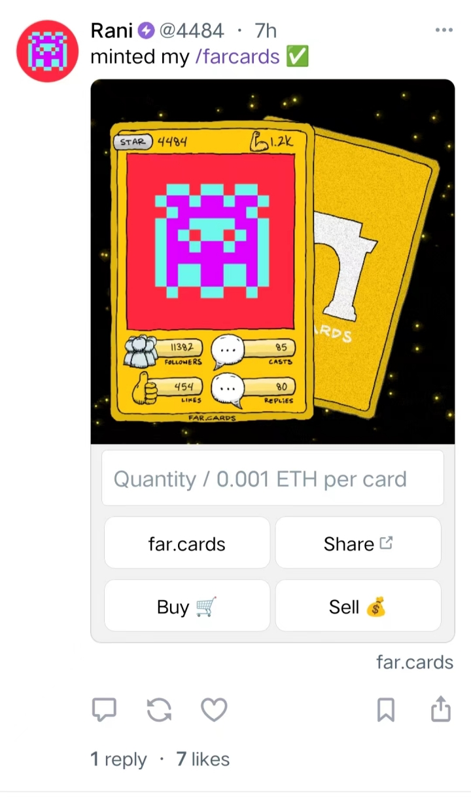

# Farcaster 社交协议

## 简介

Farcaster是一个社交协议，作为一个开源的社交关系图谱，支持开发者在这个协议上构建各种应用，其地位可以看作是Base生态的核心，现在的Base链项目的一手消息都是Farcaster上面的。

Warpcast是支持这个协议的一个客户端，也是大家最常的一个，简单理解就是一个社交APP，类比推特

## 投资背景

2022 年 7 月 13 日，Farcaster 完成 3000 万美元融资，a16z 领投

## 增长与社区

Farcaster最早是一些VC、项目方在玩，比较小众，类似知乎早期的精英模式，如V神就是重度用户，并对Farcaster给予了高度评价。btw，base chain创始人Jesse也在上面活跃。

尽管起步较慢，Farcaster通过其特色功能“**Frame**”在短时间内实现了用户数量的显著增长，日活跃用户从6000人增长到6万人。

## Frame功能

Farcaster的一个独特功能是“Frame”，它允许开发者使用API和库来开发一些有趣的功能。这种功能可以嵌入到帖子中，类似于小程序，可以调用所有链的dapp(主要是base、zora),极大地增强了帖子的互动性和功能性。

e.g 你可以在帖子中直接铸造base nft

## Warpcast玩法

玩法流程：

1. Google Store/ 国外苹果id，用来下载warpcast

2. 一个绑定了可以付款外币信用卡的苹果账户（可国内账户） / Google Store账户，因为需要支付5美金

3. 点击邀请链接，输入邮箱 https://warpcast.com/~/invite-page/399977?id=fdf16c3d

4. 注册好之后，记得保存助记词

5. 登陆网页端（用手机扫码登陆）https://warpcast.com/

6. 去网页端绑定evm钱包

7. 关注名人账号，优化信息流

   @jessepollak  base创始人

   @vitalik.eth     v神

   ...

   @arespollo  pollo   把我关注的都关注一下，顺带也关注我lol

8. 名词科普

   Cast ：一条帖子，理解成推特的一条推文

   Channel ：频道，类似豆瓣的小组，如degen channel

   Warps ：没上链的货币，类比q币，没有价值，主要用途是用来奖励别人、购买空间、租频道

