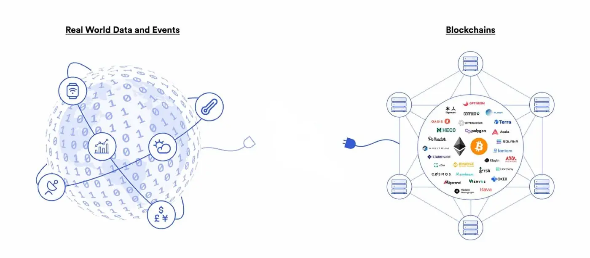
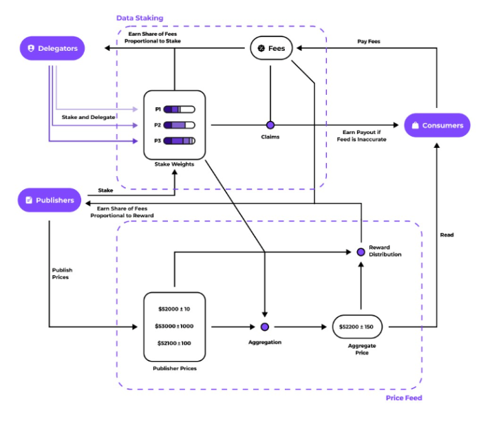
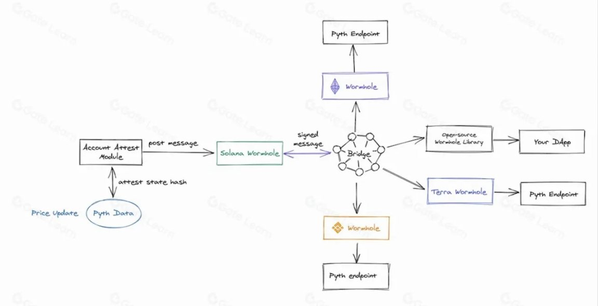

# What is an oracle and what is Pyth?

-   根据中国人民银行的定义，预言机是一种机制，其功能是将外部世界的信息写入到区块链内，实现区块链与真实世界的数据互通。它为确定的智能合约提供了与不确定的外部世界进行数据交互的途径，是区块链与现实世界数据交互的接口。简单来说，预言机就是连接区块链世界和真实世界的桥梁，让区块链能够获取真实世界的数据。如今，预言机已成为加密世界中不可或缺的基础设施，特别是在DeFi领域。在借贷协议中，价格预言机决定何时清算用户的贷款。当用户的抵押品价值下降到一定阈值以下时，账户可能被清算。衍生品平台利用预言机来计算加密资产的价值，包括期权、期货和合成资产。指数平台（如Set）使用预言机来检索指数成分的价格。没有预言机，加密世界将陷入混乱，就像没有红绿灯的交通路口一样。
-   **Pyth Network**，这是世界上最大的一手预言机网络，持续在链上发布金融市场数据。网络的数据来自 90 多家一手数据提供商，包括世界上最大的一批交易所和做市商。Pyth 为 40 多个区块链上的智能合约开发者提供加密货币、股票、外汇对、ETFs 和大宗商品的实时喂价数据总体而言，Pyth Network致力于引入高保真金融数据（Hifi）到DeFi，为DeFi提供实时的真实世界金融市场数据，从而解决DeFi对现实世界数据访问的问题。

# Why does Web3 need oracles?

关于预言机首先需要理解的是：**为何 Web2** 不需要预言机，但 Web3 一定需要？不少人经常有这样一种困惑，Binance、Coinmarket Cap 或者其他地方都有加密资产的数据，为什么 DeFi 协议和其他应用不直接拿来使用，而是需要一个预言机起作用？答案的关键，在于**链上环境的封闭性**。链上应用依照智能合约的设计执行业务并带来结果，但执行的触发条件却是从外部接收的——必须把一个外界条件带入合约中。某些网站上的加密资产价格，本质还是独立于区块链世界的外部数据，**虽然是现成的，但并不意味着能用**：我们仍需要一个助攻者的角色来把价格数据传递给链上协议，而这才是预言机必然存在的理由。那么，在区块链的世界中，假设你从某个 Defi 中按照时价购买了加密资产，大致会经历了以下过程：

-   数据源将资产价格提供给预言机；
-   预言机将价格传递给 DeFi 等应用；
-   用户以 DeFi 应用中展示的价格购买资产；

于是，**预言机在其中起到了“报价员”的作用：从上游数据源获取价格，传递给下游应用，支持应用的使用场景从而串联起了整个上下游**。

# What is the technical architecture of the Pyth oracle?

## What is the oracle problem?

预言机不仅在区块链和外部世界之间搭建数据桥梁，还致力于克服所谓的“预言机问题”。这一问题主要涉及确保外部数据的安全性、身份验证和可信度，同时考虑到外部来源可能存在的故障。

解决预言机问题通常需要经历以下步骤：

-   验证器或预言机节点源数据。
-   节点对源数据进行加密签名验证。
-   进行数据聚合和共识计算。
-   将数据传输至区块链网络。

预言机问题通常通过推送或拉取模型来解决。大多数预言机采用第三方推送模型，其中预言机节点充当中介，从第一手或第二手来源获取数据。例如，Chainlink的主要喂价预言机节点从第二手来源获取数据。推送预言机会按照设定的时间间隔将价格更新推送到各个区块链，每次更新都会产生一定的Gas费用。然而，添加价格反馈或减少链上更新延迟会增加预言机网络的成本，从而影响其可扩展性。此外，获取数据需要多重信任假设：主要来源和次要来源都必须正确稳定，而且预言机网络也必须保持稳定。

Pyth Network通过其拉取模型解决了第三方推送模型的缺点。凭借其庞大的第一手数据提供商网络，Pyth减轻了关于第三方数据可靠性的下游信任假设。在Pyth的拉取模型中，数据由网络内的实体直接提供，例如交易所、做市商和DeFi协议。这些实体受到激励，会提供可靠的数据，保持良好的声誉，并避免被协议禁止。

## What is core interaction?

Pyth 运行其协议的两个实例：一个位于 Solana 主网上，另一个位于 Pythnet 应用链上。 Solana 上的 Pyth 实例专门为 Solana 上的协议提供数据，而 Pythnet 上的 Pyth 实例为所有其他区块链上的协议提供数据。 在这两种情况下，三个核心实体进行交互以促进 Pyth 网络上的预言机更新：

-   数据提供商/发布者（如 Jane Street、CTC、Binance、0x、Raydium 等）
-   Pyth Oracle程序（聚合算法）
-   数据消费者（应用程序/开发人员）

数据提供者是 Pythnet 上的验证者。 作为 Pyth 数据的主要供应商，供应商通过在消费者发起的整个 DeFi 交易中收取少量费用来获得补偿。Pyth Oracle 程序是一种聚合算法，它结合了提供商提交的数据，并在计算过程中生成相应价格源的聚合价格和置信区间。

## What is Pyth on solana?

-   价格源由两个Solana账户表示：产品账户和价格账户。产品账户存储有关价格信息的元数据，例如股票代码、资产类型、对应的价格账户等。价格账户包含数据提供者授权的数据，包括每个提供者的名称、每个提供者提交的价格和置信区间。两个账户均由预言机程序维护，其中还包括第三个帐户，主要列出产品帐户，使应用程序能够对Pyth提供的完整价格源列表进行分类。
-   数据提供商每400毫秒（Solana上的时隙长度）提交一次价格更新。每次更新都会触发价格和置信区间的频繁聚合更新，然后由下游应用程序使用。由于Solana的成本较低，Pyth（或任何预言机）可以运行高效的推送模型，开发人员只需将相关价格源传递到其应用程序、反序列化数据并读取/集成已发布的值。通过存储每个提供商提交的单独数据值，预言机可以让提供商对性能不佳或恶意行为负责。

## What is Pyth application chain?

-   Pythnet的应用链是Solana主网的权威权益证明分支，其作为计算层来处理和聚合Pyth数据提供商网络提供的数据。由于Pythnet是Solana的一个分支，因此两者框架有些相似，但也有一些区别。
-   Pythnet上的价格信息可供50多个区块链访问，而不仅仅是Solana，因为其价格信息直接发布到区块链。Solana上的推送模型（包括账户和oracle程序）与Pythnet类似，但Pythnet不是目标链，也不向提供商收取提交价格的费用。
-   数据提供者在将数据推送到Pythnet进行聚合并通过oracle程序序列化到账户的同时，这些数据随后通过Wormhole跨链消息协议广播到其他区块链。

## How to implement cross-chain message passing?

大概在Pythnet链上的一个跨链消息传递步骤如下:

-   在Pythnet上发布和聚合数据后，数据不会立即通过Wormhole路由。相反，Pyth通过消息缓冲区路由其数据，并将其散列到Merkle树中。这确保用户可以选择将哪些更新包含在单个事务中，从而降低成本，并允许数据更新包含任意计算。
-   每次聚合更新后，聚合程序都会向消息缓冲区添加一条消息。对于每个时间段，Pythnet验证器读取消息并创建Merkle树，然后将包含所有价格的Merkle根的消息发送到Pythnet上的Wormhole合约。
-   随后，Wormhole管理员（Wormhole节点）读取Merkle根消息，创建可验证操作批准（VAA），并将价格更新广播到相关区块链。VAA包含Wormhole管理员的签名，用于确认管理员已经见证并验证了VAA，包括虫洞守护者的签名。
-   这些签名确认守护者已经见证并验证了消息中包含的信息，即价格的Merkle根。签名VAA是一种可验证且安全的方法，用于确认从Pythnet传输到目标区块链的数据的准确性，并已得到可信方（虫洞守护者）的验证。

## What is Hermes API?

Hermes是一个 Web API，抽象了开发人员更新启动过程。 如果没有像 Hermes 这样的服务，开发人员将不得不手动编译具有所需价格源的更新有效负载，并使用经过虫洞验证的 Merkle 根从 Pythnet 获取相应的数据和 Merkle 证明。 Hermes 使开发人员能够轻松查询 Web 服务以访问预言机价格。 它允许数据消费者从 REST 或 WebSocket API 检索最新价格。

WebSocket API 特点：

-   最适合需要实时连续数据流的应用。
-   维护成本低：初始设置后，可以来回发送数据，而无需重复 HTTP 标头的开销，这对于频繁的数据传输非常高效。
-   实时更新由于客户端和服务器之间的持续连接，使得数据可以立即更新。
-   场景：套利交易、收益率优化工具、DEX交易等。

# How is Pyth different from Chainlink?

聊到预言机，Chainlink是绕不过去的一道坎，Pyth和Chainlink究竟有何差异？总体来看，Pyth采用了与Chainlink截然不同的设计方案，核心区别在于：谁在链上提交数据？

1. 机制上:Chainlink的机制设计包含数据需求方、预言机节点和数据源三种角色，由第三方节点提交数据进行聚合，充当中介，同时也获取收益。Pyth的机制是直接点对点进行，让数据提供者直接把数据放在链上，消除第三方中介，核心差异即是Pyth所宣传的"Hi-fi for DeFi"，高保真金融数据。
2. 成本上:Pyth消除了和节点共享收入的需求，提高了数据供给方自身的盈利能力。Chainlink的数据聚合可以发生在链上或链下，如果是链上聚合，每个预言机节点在向链合约提交价格时都需要支付Gas费，而链下聚合只有一个聚合的价格被提交到链上，成本较低。
3. 覆盖范围上:Chainlink作为DeFi 发展多年的主要预言机主导者，具备先发的市场优势。尽管如此，Pyth虽然是后起之秀但是在覆盖的区块链数量和安全价值方面处于领先地位。 就覆盖区块链的多样性和安全价值而言，Chainlink 是 Pyth 的主要竞争。此外Pyth选择Solana作为大本营，高TPS以及低Gas的环境，让数据提供者直接在链上提交他们的价格进行汇总变得简单直接，因此可以选择皆链上聚合。

一些更详细的对比如下:

# Conclusion

综上所述,我们可以总结出关于Pyth Network的几个要点：

-   培育数据提供商网络和保证数据可靠准确：Pyth培育了第一方数据提供商网络，确保数据的可靠性和及时性。此外Pyth直接从原始数据源维护市场数据，确保数据的准确性和可靠性。
-   基于拉动的预言机模式：相较Chainlink等传统预言机，采用基于拉动的预言机模式，将成本转嫁给了预言机用户，降低了整个网络的成本。
-   提高价格更新频率：Pyth的设计使得价格更新频率更高，数据更新更及时，有助于市场参与者做出更准确的决策。
-   广泛服务区块链：Pyth已扩展到为大多数区块链提供服务，覆盖了广泛的市场需求。Pyth在市场上占据了总价值第四大份额，彰显了其在行业中的地位和影响力。

从8月主网正式上线至今，一共有37个Solana链上应用集成了Pyth的预言机服务，涵盖DEX、衍生品、DeFi借贷、稳定币、合成资产、ETF、资产管理平台、基础设施……Solana生态的明星项目，诸如jetprotocol、lifinity、drift均使用Pyth喂价。未来Pyth的市场价值有望得到进一步体现。

# Reference and Relevant resources

-   Online deck:https://docs.google.com/presentation/d/1I4ZnINpIBDUtu67AUfIzmGbBMI6QRuSjN4s8ljX65Fc/edit?usp=sharing
-   Reference:

    -   https://pyth.network/

    -   https://chain.link/
    -   https://www.binance.com/zh-CN/square/post/4142724308034

    -   https://www.bitget.fit/zh-CN/academy/what-is-wormhole-w-and-how-does-it-work

    -   https://www.techflowpost.com/article/detail_9783.html

    -   http://defiplot.com/blog/pyth-research-report/
