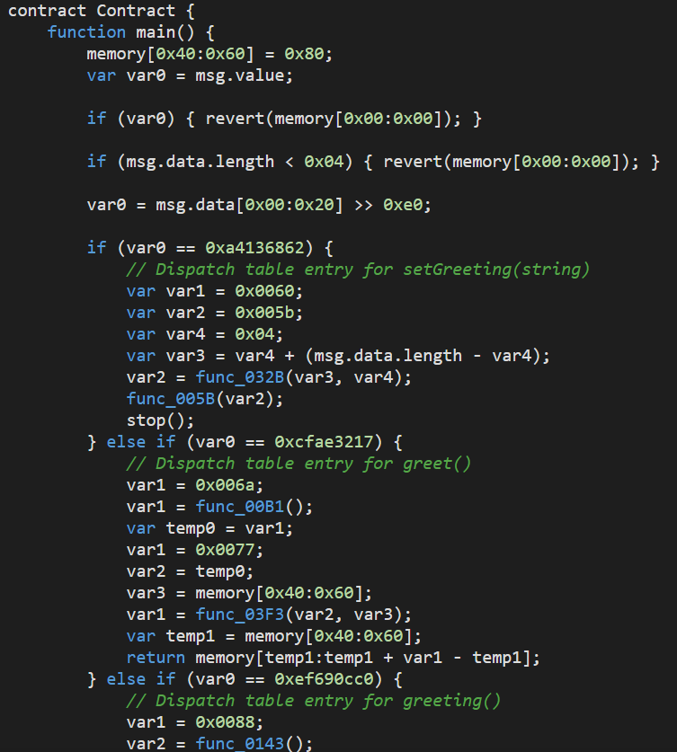

# 以太坊智能合约初探

*Author: [Autosaida](https://github.com/Autosaida); Written: 10/2022*

## 前言

智能合约作为以太坊最突出的创新点，让区块链拥有了更多可能。

什么是智能合约，智能合约的整个生命周期是怎样的，具体是如何部署在链上的，又是如何运行的，其变量又是如何存储的，下面对相关问题进行研究学习。

## 简介

宏观上来看，智能合约可以理解为一个存储在链上、运行在以太坊虚拟机EVM中的实例化对象。且根据区块链的特性，这个实例化对象将永远存在区块链网络中（除非进行自毁），一旦部署，智能合约的代码就无法改变，修改代码的唯一方法是部署新实例。

智能合约通常用高级语言编写，例如solidity。代码经过编译生成字节码，可以在基于栈的虚拟机EVM中执行。合约对象拥有自己的函数（类方法）和状态变量（类变量），但显然对象并不是一个程序，并没有程序入口，因此只有被调用时才能执行其代码。

具体来讲，**智能合约是以太坊中的一种账户**（CA，Contract Account），即可以拥有以太币余额、可发起交易的实体，另一种账户就是由用户私钥控制的外部账户（EOA，Externally Owned Account）。


如上图所示，两种账户都有自己的地址、余额以及nonce，除此之外合约账户还有存储和代码部分，对应合约实例的状态变量和函数。

而以太坊被视为由交易驱动的状态机，交易是由外部帐户发出、进行签名、且最终更新以太坊网络状态的操作。


如上图所示，以太坊有几种不同类型的交易：

1. 常规交易：从一个帐户到另一个帐户的交易，即进行ETH转账，目标可以是外部账户也可以是合约账户。
2. 合约部署交易：没有目标地址`to`字段的交易，即外部账户创建智能合约，交易的`data`字段即为合约的部署、执行代码。
3. 执行合约：即外部账户与已经部署在链上的智能合约进行交互，调用其合约函数的交易。

因此，**智能合约也是参与交易，对区块链进行状态转换的重要组成部分**。

下面将以一个简单的合约为例，探索智能合约的整个生命周期：编译->部署->执行->销毁。

## 编译

智能合约由高级语言实现后，需要首先经编译器编译为EVM可执行的字节码。

这里编译的智能合约如下。

``` solidity
// SPDX-License-Identifier: UNLICENSED
pragma solidity ^0.8.0;

import "hardhat/console.sol";

contract Greeter {
    string public greeting;

    constructor(string memory _greeting) {
        greeting = _greeting;
    }

    function greet() public view returns (string memory) {
        return greeting;
    }

    function setGreeting(string memory _greeting) public {
        greeting = _greeting;
    }
}
```

### bytecode

使用hardhat编译后可以得到两个字节序列，bytecode和deployedBytecode。

``` json
"bytecode": "0x60806040523480156200001157600080fd5b5060405162000ca938038062000ca98339818101604052810190620000379190620001e3565b80600090816200004891906200047f565b505062000566565b6000604051905090565b600080fd5b600080fd5b600080fd5b600080fd5b6000601f19601f8301169050919050565b7f4e487b7100000000000000000000000000000000000000000000000000000000600052604160045260246000fd5b620000b9826200006e565b810181811067ffffffffffffffff82111715620000db57620000da6200007f565b5b80604052505050565b6000620000f062000050565b9050620000fe8282620000ae565b919050565b600067ffffffffffffffff8211156200012157620001206200007f565b5b6200012c826200006e565b9050602081019050919050565b60005b83811015620001595780820151818401526020810190506200013c565b60008484015250505050565b60006200017c620001768462000103565b620000e4565b9050828152602081018484840111156200019b576200019a62000069565b5b620001a884828562000139565b509392505050565b600082601f830112620001c857620001c762000064565b5b8151620001da84826020860162000165565b91505092915050565b600060208284031215620001fc57620001fb6200005a565b5b600082015167ffffffffffffffff8111156200021d576200021c6200005f565b5b6200022b84828501620001b0565b91505092915050565b600081519050919050565b7f4e487b7100000000000000000000000000000000000000000000000000000000600052602260045260246000fd5b600060028204905060018216806200028757607f821691505b6020821081036200029d576200029c6200023f565b5b50919050565b60008190508160005260206000209050919050565b60006020601f8301049050919050565b600082821b905092915050565b600060088302620003077fffffffffffffffffffffffffffffffffffffffffffffffffffffffffffffffff82620002c8565b620003138683620002c8565b95508019841693508086168417925050509392505050565b6000819050919050565b6000819050919050565b6000620003606200035a62000354846200032b565b62000335565b6200032b565b9050919050565b6000819050919050565b6200037c836200033f565b620003946200038b8262000367565b848454620002d5565b825550505050565b600090565b620003ab6200039c565b620003b881848462000371565b505050565b5b81811015620003e057620003d4600082620003a1565b600181019050620003be565b5050565b601f8211156200042f57620003f981620002a3565b6200040484620002b8565b8101602085101562000414578190505b6200042c6200042385620002b8565b830182620003bd565b50505b505050565b600082821c905092915050565b6000620004546000198460080262000434565b1980831691505092915050565b60006200046f838362000441565b9150826002028217905092915050565b6200048a8262000234565b67ffffffffffffffff811115620004a657620004a56200007f565b5b620004b282546200026e565b620004bf828285620003e4565b600060209050601f831160018114620004f75760008415620004e2578287015190505b620004ee858262000461565b8655506200055e565b601f1984166200050786620002a3565b60005b8281101562000531578489015182556001820191506020850194506020810190506200050a565b868310156200055157848901516200054d601f89168262000441565b8355505b6001600288020188555050505b505050505050565b61073380620005766000396000f3fe608060405234801561001057600080fd5b50600436106100415760003560e01c8063a413686214610046578063cfae321714610062578063ef690cc014610080575b600080fd5b610060600480360381019061005b919061032b565b61009e565b005b61006a6100b1565b60405161007791906103f3565b60405180910390f35b610088610143565b60405161009591906103f3565b60405180910390f35b80600090816100ad919061062b565b5050565b6060600080546100c090610444565b80601f01602080910402602001604051908101604052809291908181526020018280546100ec90610444565b80156101395780601f1061010e57610100808354040283529160200191610139565b820191906000526020600020905b81548152906001019060200180831161011c57829003601f168201915b5050505050905090565b6000805461015090610444565b80601f016020809104026020016040519081016040528092919081815260200182805461017c90610444565b80156101c95780601f1061019e576101008083540402835291602001916101c9565b820191906000526020600020905b8154815290600101906020018083116101ac57829003601f168201915b505050505081565b6000604051905090565b600080fd5b600080fd5b600080fd5b600080fd5b6000601f19601f8301169050919050565b7f4e487b7100000000000000000000000000000000000000000000000000000000600052604160045260246000fd5b610238826101ef565b810181811067ffffffffffffffff8211171561025757610256610200565b5b80604052505050565b600061026a6101d1565b9050610276828261022f565b919050565b600067ffffffffffffffff82111561029657610295610200565b5b61029f826101ef565b9050602081019050919050565b82818337600083830152505050565b60006102ce6102c98461027b565b610260565b9050828152602081018484840111156102ea576102e96101ea565b5b6102f58482856102ac565b509392505050565b600082601f830112610312576103116101e5565b5b81356103228482602086016102bb565b91505092915050565b600060208284031215610341576103406101db565b5b600082013567ffffffffffffffff81111561035f5761035e6101e0565b5b61036b848285016102fd565b91505092915050565b600081519050919050565b600082825260208201905092915050565b60005b838110156103ae578082015181840152602081019050610393565b60008484015250505050565b60006103c582610374565b6103cf818561037f565b93506103df818560208601610390565b6103e8816101ef565b840191505092915050565b6000602082019050818103600083015261040d81846103ba565b905092915050565b7f4e487b7100000000000000000000000000000000000000000000000000000000600052602260045260246000fd5b6000600282049050600182168061045c57607f821691505b60208210810361046f5761046e610415565b5b50919050565b60008190508160005260206000209050919050565b60006020601f8301049050919050565b600082821b905092915050565b6000600883026104d77fffffffffffffffffffffffffffffffffffffffffffffffffffffffffffffffff8261049a565b6104e1868361049a565b95508019841693508086168417925050509392505050565b6000819050919050565b6000819050919050565b600061052861052361051e846104f9565b610503565b6104f9565b9050919050565b6000819050919050565b6105428361050d565b61055661054e8261052f565b8484546104a7565b825550505050565b600090565b61056b61055e565b610576818484610539565b505050565b5b8181101561059a5761058f600082610563565b60018101905061057c565b5050565b601f8211156105df576105b081610475565b6105b98461048a565b810160208510156105c8578190505b6105dc6105d48561048a565b83018261057b565b50505b505050565b600082821c905092915050565b6000610602600019846008026105e4565b1980831691505092915050565b600061061b83836105f1565b9150826002028217905092915050565b61063482610374565b67ffffffffffffffff81111561064d5761064c610200565b5b6106578254610444565b61066282828561059e565b600060209050601f8311600181146106955760008415610683578287015190505b61068d858261060f565b8655506106f5565b601f1984166106a386610475565b60005b828110156106cb578489015182556001820191506020850194506020810190506106a6565b868310156106e857848901516106e4601f8916826105f1565b8355505b6001600288020188555050505b50505050505056fea26469706673582212209066875f32a43c988b58ada125306c30a7a86fb49abd7bf8abf4a479062fa4a564736f6c63430008110033",
"deployedBytecode": "0x608060405234801561001057600080fd5b50600436106100415760003560e01c8063a413686214610046578063cfae321714610062578063ef690cc014610080575b600080fd5b610060600480360381019061005b919061032b565b61009e565b005b61006a6100b1565b60405161007791906103f3565b60405180910390f35b610088610143565b60405161009591906103f3565b60405180910390f35b80600090816100ad919061062b565b5050565b6060600080546100c090610444565b80601f01602080910402602001604051908101604052809291908181526020018280546100ec90610444565b80156101395780601f1061010e57610100808354040283529160200191610139565b820191906000526020600020905b81548152906001019060200180831161011c57829003601f168201915b5050505050905090565b6000805461015090610444565b80601f016020809104026020016040519081016040528092919081815260200182805461017c90610444565b80156101c95780601f1061019e576101008083540402835291602001916101c9565b820191906000526020600020905b8154815290600101906020018083116101ac57829003601f168201915b505050505081565b6000604051905090565b600080fd5b600080fd5b600080fd5b600080fd5b6000601f19601f8301169050919050565b7f4e487b7100000000000000000000000000000000000000000000000000000000600052604160045260246000fd5b610238826101ef565b810181811067ffffffffffffffff8211171561025757610256610200565b5b80604052505050565b600061026a6101d1565b9050610276828261022f565b919050565b600067ffffffffffffffff82111561029657610295610200565b5b61029f826101ef565b9050602081019050919050565b82818337600083830152505050565b60006102ce6102c98461027b565b610260565b9050828152602081018484840111156102ea576102e96101ea565b5b6102f58482856102ac565b509392505050565b600082601f830112610312576103116101e5565b5b81356103228482602086016102bb565b91505092915050565b600060208284031215610341576103406101db565b5b600082013567ffffffffffffffff81111561035f5761035e6101e0565b5b61036b848285016102fd565b91505092915050565b600081519050919050565b600082825260208201905092915050565b60005b838110156103ae578082015181840152602081019050610393565b60008484015250505050565b60006103c582610374565b6103cf818561037f565b93506103df818560208601610390565b6103e8816101ef565b840191505092915050565b6000602082019050818103600083015261040d81846103ba565b905092915050565b7f4e487b7100000000000000000000000000000000000000000000000000000000600052602260045260246000fd5b6000600282049050600182168061045c57607f821691505b60208210810361046f5761046e610415565b5b50919050565b60008190508160005260206000209050919050565b60006020601f8301049050919050565b600082821b905092915050565b6000600883026104d77fffffffffffffffffffffffffffffffffffffffffffffffffffffffffffffffff8261049a565b6104e1868361049a565b95508019841693508086168417925050509392505050565b6000819050919050565b6000819050919050565b600061052861052361051e846104f9565b610503565b6104f9565b9050919050565b6000819050919050565b6105428361050d565b61055661054e8261052f565b8484546104a7565b825550505050565b600090565b61056b61055e565b610576818484610539565b505050565b5b8181101561059a5761058f600082610563565b60018101905061057c565b5050565b601f8211156105df576105b081610475565b6105b98461048a565b810160208510156105c8578190505b6105dc6105d48561048a565b83018261057b565b50505b505050565b600082821c905092915050565b6000610602600019846008026105e4565b1980831691505092915050565b600061061b83836105f1565b9150826002028217905092915050565b61063482610374565b67ffffffffffffffff81111561064d5761064c610200565b5b6106578254610444565b61066282828561059e565b600060209050601f8311600181146106955760008415610683578287015190505b61068d858261060f565b8655506106f5565b601f1984166106a386610475565b60005b828110156106cb578489015182556001820191506020850194506020810190506106a6565b868310156106e857848901516106e4601f8916826105f1565b8355505b6001600288020188555050505b50505050505056fea26469706673582212209066875f32a43c988b58ada125306c30a7a86fb49abd7bf8abf4a479062fa4a564736f6c63430008110033",
```

可以注意到，deployedBytecode是bytecode的子集，位于bytecode的后半部分，其前一个字节为0xfe，是evm中的INVALID指令，将bytecode分隔为前后两部分。

前一部分即initial code，或者叫creation bytecode，后一部分为deployedBytecode，或者说是runtime bytecode。

初始化代码，即创建智能合约的代码，用于将运行时代码存储在链上，需要执行构造函数、初始化相关状态变量，并计算运行时代码（将一大块数据读入内存），最终将其返回给EVM。显然初始化工作只需要在创建时执行一次，并不需要存储在链上。

运行时字节码，是最终存储在链上的合约对象的代码，可以在后续的交易中被执行。

上述bytecode就是初始化代码和运行时字节码的合并。

### ABI

除了字节码，还得到了合约接口的ABI。

``` json
"abi": [
    {
      "inputs": [
        {
          "internalType": "string",
          "name": "_greeting",
          "type": "string"
        }
      ],
      "stateMutability": "nonpayable",
      "type": "constructor"
    },
    {
      "inputs": [],
      "name": "greet",
      "outputs": [
        {
          "internalType": "string",
          "name": "",
          "type": "string"
        }
      ],
      "stateMutability": "view",
      "type": "function"
    },
    {
      "inputs": [],
      "name": "greeting",
      "outputs": [
        {
          "internalType": "string",
          "name": "",
          "type": "string"
        }
      ],
      "stateMutability": "view",
      "type": "function"
    },
    {
      "inputs": [
        {
          "internalType": "string",
          "name": "_greeting",
          "type": "string"
        }
      ],
      "name": "setGreeting",
      "outputs": [],
      "stateMutability": "nonpayable",
      "type": "function"
    }
  ],
```

合约应用二进制接口Application Binary Interface（ABI）是从区块链外部与合约进行交互或者合约与合约间进行交互的一种标准方式。使用的数据会根据其类型按照规定的方法进行编码。

更通俗的理解，包含两方面内容：
1. ABI是合约接口的说明。
2. ABI定义与合约进行交互的数据编码规则。

ABI是合约接口的说明，内容包括合约的函数名称、参数名称、参数类型等信息。这些信息以JSON格式保存，如上述编译得到的abi数据。知道这些信息可以便于与合约交互。相关字段含义可见[abi-spec-json](https://docs.soliditylang.org/en/latest/abi-spec.html#json)。

而具体来说如何将调用信息传给evm，显然evm需要接收字节序列，那么如何将要调用的函数名称、具体的参数信息传给evm，让虚拟机正确执行我们想要执行的代码逻辑，就是ABI的另一个作用，定义与合约进行交互的数据编码规则，具体可见[abi-spec](https://docs.soliditylang.org/en/latest/abi-spec.html)。

## 部署

合约编译完成后，就可以部署在链上，供外部用户直接或间接的使用。

部署代码如下。

``` typescript
import { ethers } from "hardhat";
import { Greeter__factory } from "../typechain/factories/Greeter__factory";

async function main() {
  const [signer] = await ethers.getSigners();
  console.log(signer.address);

  let G = await new Greeter__factory(signer);
  let g = await G.deploy("123");
  g = await g.deployed();
  
  let b = "0x60806040523480156200001157600080fd5b5060405162000ca938038062000ca98339818101604052810190620000379190620001e3565b80600090816200004891906200047f565b505062000566565b6000604051905090565b600080fd5b600080fd5b600080fd5b600080fd5b6000601f19601f8301169050919050565b7f4e487b7100000000000000000000000000000000000000000000000000000000600052604160045260246000fd5b620000b9826200006e565b810181811067ffffffffffffffff82111715620000db57620000da6200007f565b5b80604052505050565b6000620000f062000050565b9050620000fe8282620000ae565b919050565b600067ffffffffffffffff8211156200012157620001206200007f565b5b6200012c826200006e565b9050602081019050919050565b60005b83811015620001595780820151818401526020810190506200013c565b60008484015250505050565b60006200017c620001768462000103565b620000e4565b9050828152602081018484840111156200019b576200019a62000069565b5b620001a884828562000139565b509392505050565b600082601f830112620001c857620001c762000064565b5b8151620001da84826020860162000165565b91505092915050565b600060208284031215620001fc57620001fb6200005a565b5b600082015167ffffffffffffffff8111156200021d576200021c6200005f565b5b6200022b84828501620001b0565b91505092915050565b600081519050919050565b7f4e487b7100000000000000000000000000000000000000000000000000000000600052602260045260246000fd5b600060028204905060018216806200028757607f821691505b6020821081036200029d576200029c6200023f565b5b50919050565b60008190508160005260206000209050919050565b60006020601f8301049050919050565b600082821b905092915050565b600060088302620003077fffffffffffffffffffffffffffffffffffffffffffffffffffffffffffffffff82620002c8565b620003138683620002c8565b95508019841693508086168417925050509392505050565b6000819050919050565b6000819050919050565b6000620003606200035a62000354846200032b565b62000335565b6200032b565b9050919050565b6000819050919050565b6200037c836200033f565b620003946200038b8262000367565b848454620002d5565b825550505050565b600090565b620003ab6200039c565b620003b881848462000371565b505050565b5b81811015620003e057620003d4600082620003a1565b600181019050620003be565b5050565b601f8211156200042f57620003f981620002a3565b6200040484620002b8565b8101602085101562000414578190505b6200042c6200042385620002b8565b830182620003bd565b50505b505050565b600082821c905092915050565b6000620004546000198460080262000434565b1980831691505092915050565b60006200046f838362000441565b9150826002028217905092915050565b6200048a8262000234565b67ffffffffffffffff811115620004a657620004a56200007f565b5b620004b282546200026e565b620004bf828285620003e4565b600060209050601f831160018114620004f75760008415620004e2578287015190505b620004ee858262000461565b8655506200055e565b601f1984166200050786620002a3565b60005b8281101562000531578489015182556001820191506020850194506020810190506200050a565b868310156200055157848901516200054d601f89168262000441565b8355505b6001600288020188555050505b505050505050565b61073380620005766000396000f3fe608060405234801561001057600080fd5b50600436106100415760003560e01c8063a413686214610046578063cfae321714610062578063ef690cc014610080575b600080fd5b610060600480360381019061005b919061032b565b61009e565b005b61006a6100b1565b60405161007791906103f3565b60405180910390f35b610088610143565b60405161009591906103f3565b60405180910390f35b80600090816100ad919061062b565b5050565b6060600080546100c090610444565b80601f01602080910402602001604051908101604052809291908181526020018280546100ec90610444565b80156101395780601f1061010e57610100808354040283529160200191610139565b820191906000526020600020905b81548152906001019060200180831161011c57829003601f168201915b5050505050905090565b6000805461015090610444565b80601f016020809104026020016040519081016040528092919081815260200182805461017c90610444565b80156101c95780601f1061019e576101008083540402835291602001916101c9565b820191906000526020600020905b8154815290600101906020018083116101ac57829003601f168201915b505050505081565b6000604051905090565b600080fd5b600080fd5b600080fd5b600080fd5b6000601f19601f8301169050919050565b7f4e487b7100000000000000000000000000000000000000000000000000000000600052604160045260246000fd5b610238826101ef565b810181811067ffffffffffffffff8211171561025757610256610200565b5b80604052505050565b600061026a6101d1565b9050610276828261022f565b919050565b600067ffffffffffffffff82111561029657610295610200565b5b61029f826101ef565b9050602081019050919050565b82818337600083830152505050565b60006102ce6102c98461027b565b610260565b9050828152602081018484840111156102ea576102e96101ea565b5b6102f58482856102ac565b509392505050565b600082601f830112610312576103116101e5565b5b81356103228482602086016102bb565b91505092915050565b600060208284031215610341576103406101db565b5b600082013567ffffffffffffffff81111561035f5761035e6101e0565b5b61036b848285016102fd565b91505092915050565b600081519050919050565b600082825260208201905092915050565b60005b838110156103ae578082015181840152602081019050610393565b60008484015250505050565b60006103c582610374565b6103cf818561037f565b93506103df818560208601610390565b6103e8816101ef565b840191505092915050565b6000602082019050818103600083015261040d81846103ba565b905092915050565b7f4e487b7100000000000000000000000000000000000000000000000000000000600052602260045260246000fd5b6000600282049050600182168061045c57607f821691505b60208210810361046f5761046e610415565b5b50919050565b60008190508160005260206000209050919050565b60006020601f8301049050919050565b600082821b905092915050565b6000600883026104d77fffffffffffffffffffffffffffffffffffffffffffffffffffffffffffffffff8261049a565b6104e1868361049a565b95508019841693508086168417925050509392505050565b6000819050919050565b6000819050919050565b600061052861052361051e846104f9565b610503565b6104f9565b9050919050565b6000819050919050565b6105428361050d565b61055661054e8261052f565b8484546104a7565b825550505050565b600090565b61056b61055e565b610576818484610539565b505050565b5b8181101561059a5761058f600082610563565b60018101905061057c565b5050565b601f8211156105df576105b081610475565b6105b98461048a565b810160208510156105c8578190505b6105dc6105d48561048a565b83018261057b565b50505b505050565b600082821c905092915050565b6000610602600019846008026105e4565b1980831691505092915050565b600061061b83836105f1565b9150826002028217905092915050565b61063482610374565b67ffffffffffffffff81111561064d5761064c610200565b5b6106578254610444565b61066282828561059e565b600060209050601f8311600181146106955760008415610683578287015190505b61068d858261060f565b8655506106f5565b601f1984166106a386610475565b60005b828110156106cb578489015182556001820191506020850194506020810190506106a6565b868310156106e857848901516106e4601f8916826105f1565b8355505b6001600288020188555050505b50505050505056fea26469706673582212209066875f32a43c988b58ada125306c30a7a86fb49abd7bf8abf4a479062fa4a564736f6c63430008110033";
  let coder = new ethers.utils.AbiCoder();
  let s = coder.encode(["string"],["123"]).substring(2);
  b += s;
  
  const tx = await signer.sendTransaction({
    data: b,
  });
  
  console.log(g.deployTransaction.data == b);
}

main().catch((error) => {
  console.error(error);
  process.exitCode = 1;
});
```

这里使用两种方式，先是直接使用`ContractFactory`进行部署，之后则通过发送交易的方式来部署，实质上是一样的。

如前面所说，合约的创建实际上就是没有目标地址`to`字段的交易，交易的`data`字段即为合约部署、执行的bytecode。这里构造函数需要传入参数，故需要先对传入参数进行abi编码，再直接附加到bytecode后即可。可以验证两种部署方式最终的`data`是一致的。

而最终的合约地址是如何得到的，可参考[How is the address of an Ethereum contract computed](https://ethereum.stackexchange.com/questions/760/how-is-the-address-of-an-ethereum-contract-computed)。

下面简单分析部署时执行的initial code，使用[在线网站](https://ethervm.io/decompile)，直接阅读反编译得到的伪代码，或者参考[evm文档](https://www.evm.codes/)，阅读反汇编得到的指令。


首先初始化空闲内存指针为0x80，之后判断msg.value的值是否为0，由于这里的合约构造函数并没有声明为`payable`，因此不能接收以太币，value不为0则revert。

如下面这样进行部署就会revert。

``` typescript
let g = await G.deploy("123", {value : ethers.utils.parseEther("1")});
let p = ethers.provider;
g = await g.deployed();
console.log(await p.getBalance(g.address));
```

之后的temp1，将传入的code序列的长度减去0xca9，0xca9就是前面的bytecode的长度，因此这里temp1得到的实际上是传入的参数字节序列的长度。

之后调用了两个比较复杂的`func_01E3`和`func_047F`函数。主要就是执行构造函数，即将传入的字符串参数存储到对应的位置。这里greeting状态变量显然应该存储在slot0中，故需要计算出对应的位置，再进行存储。

最后将运行时代码读入内存。再返回给EVM。

## 执行

合约部署完成后，就可以被外部账户直接或间接的调用，在EVM中执行代码。

如下所示，可以直接在部署后的合约实例上进行相关调用。

``` typescript
  const [signer] = await ethers.getSigners();
  
  let G = await new Greeter__factory(signer);
  let g = await G.deploy("123");
  g = await g.deployed();

  console.log(await g.greet());
  let tx = await g.setGreeting("456");
  await tx.wait();
  console.log(tx.data);
  console.log(await g.greet());
```

这里通过`tx.data`查看调用合约时交易发送的calldata。

``` 
0xa4136862000000000000000000000000000000000000000000000000000000000000002000000000000000000000000000000000000000000000000000000000000000033435360000000000000000000000000000000000000000000000000000000000
```

实际上就是根据ABI规定的标准进行编码后得到的数据。

前4个字节为函数选择器，标识了将要执行目标合约的哪个函数，后面则是使用的参数。

而函数选择器实际上就是函数签名的keccak256哈希的前4个字节。

因此使用下面两种方式，直接构造calldata，然后发送交易，来调用合约的目标函数，效果也是一样的。

``` typescript
  const itace = new ethers.utils.Interface(["function setGreeting(string)"]);
  const calldata1 = itace.encodeFunctionData("setGreeting", ["789"]);
  console.log(calldata1);
  tx = await signer.sendTransaction({
    to:g.address,
    data:calldata1,
  })
  await tx.wait();
  console.log(await g.greet());


  let func_selector = ethers.utils.id("setGreeting(string)").substring(0, 10);
  let coder = new ethers.utils.AbiCoder();
  let data = coder.encode(["string"],["123"]).substring(2);
  let calldata2 = func_selector+data;
  console.log(calldata2);
  tx = await signer.sendTransaction({
    to:g.address,
    data:calldata2,
  })
  await tx.wait();
  console.log(await g.greet());
```

下面简单分析合约的runtime bytecode，看函数选择器是如何发挥作用的。



可以看到由于合约没有设置`receive`函数，也没有`payable`函数，不能接收以太币，故在最开始判断若value不为0则revert。

之后由于函数选择器是4个字节，故要执行函数的calldata至少也应该是4个字节，否则revert。

然后取calldata的前4字节，即函数选择器，后续是一个if/else组成的dispatcher，会根据函数选择器的值，进入不同的分支，从而执行对应的函数。

这里显示合约有三个函数，多出的一个`greeting()`是编译器为我们自动生成的用于读取状态变量`greeting`的函数。

4个字节的函数选择器可以在[ethereum signature database](https://www.4byte.directory/signatures/)查询，得到对应的函数签名。

这里区分一下合约函数调用与交易的概念。

有些函数为`view`或`pure`，如这里的`greet()`函数，并不会改变状态变量，因此实际上只需要在节点本地执行一下即可，即不改变整个区块链的状态，不需要广播、达成共识最终写入区块链，这样的调用也就不是交易，在底层调用的是`eth_call`。

而改变状态的函数调用，才是一个交易，底层调用的是`eth_sendTransaction`。

需要注意的是，虽然诸如`view`或`pure`这样的函数，直接调用的话默认情况下执行`eth_call`，不改变区块链状态，但也可以主动发送交易来进行调用（虽然好像只会浪费gas）。

如下所示，可以调用`greet()`函数，发起一个交易。

``` typescript
const itace = new ethers.utils.Interface(["function greet()"]);
  const calldata = itace.encodeFunctionData("greet");

  let tx = await signer.sendTransaction({
    to: g.address,
    data: calldata
  })
  await tx.wait();
  console.log(tx.data);
```

## 销毁

合约可以调用`selfdestruct`函数来实现自毁，可以向合约中添加如下函数。

``` solidity
function destroySmartContract(address payable _to) public {
        selfdestruct(_to);
    }
```

自毁函数接收一个参数，会将合约余额转给目标地址。

自毁并不会改变过去已经上链的区块中的数据。但在自毁之后的所有区块中，该合约的状态和代码会被删除。

如下调用自毁函数后，再调用原合约函数，就会报错。

``` typescript
let tx = await g.destroySmartContract(signer.address);
await tx.wait();
console.log(await g.greet());
```

## 存储空间

前面提到EVM是基于栈的虚拟机，在分析bytecode时又提到了内存，而状态变量又是永久存储在链上，显然这些都是不同的存储空间。

可参考[Storage, Memory and the Stack](https://docs.soliditylang.org/en/latest/introduction-to-smart-contracts.html#storage-memory-and-the-stack)。以太坊虚拟机有3个区域用来存储数据：栈（stack）、内存（memory）和存储（storage）。


如上图所示，栈和内存在EVM执行代码时临时使用，而状态变量涉及的合约存储部分则永久保存在链上。整个EVM的执行模型如下。


三种存储空间的类型如下。


### 栈


栈是一个256 bits×1024的空间，EVM是基于栈的，所有的计算都在栈上执行，因此通常存储指令的操作数。

### 内存


内存是线性的，可按字节级寻址，用于存储对象，内存分配方式为顺序分配。编程中，如果一个局部变量属于变长字节数组、字符串、结构体等类型，其通常会被memory修饰符修饰，以表明存储在内存中。

内存中前4个32字节的slot被保留，具体如下。

0x00 - 0x3f（64 字节）：哈希方法的暂存空间

0x40 - 0x5f（32 字节）：空闲内存指针，指向下一个对象将要被存储的地址

0x60 - 0x7f（32 字节）：0-slot

0-slot用作动态内存数组的初始值，并且永远不应该被写入，而由于内存是顺序分配的，空闲内存指针显然会被初始化为0x80，和前面分析合约bytecode时的结果一致。

### 存储（storage）


合约存储是一个256 bits 映射到 256 bits的键值存储，用于持久化存储合约账户的状态变量。

具体可见参考[solidity文档](https://docs.soliditylang.org/en/latest/internals/layout_in_storage.html)，结合知道创宇的例子[智能合约变量储存机制详解](https://zhuanlan.zhihu.com/p/414840665)，了解状态变量在存储中的布局。

## 参考链接

[ethereum_evm_illustrated](https://takenobu-hs.github.io/downloads/ethereum_evm_illustrated.pdf)

[以太坊开发者文档](https://ethereum.org/zh/developers/docs)

[以太坊技术与实现](https://learnblockchain.cn/books/geth)

[完全理解以太坊智能合约](https://learnblockchain.cn/2018/01/04/understanding-smart-contracts)

[智能合约编写之Solidity运行原理](https://www.infoq.cn/article/sZhX9ujD6Bqq3UhkO4Hk)

[精通以太坊-智能合约](https://www.jianshu.com/p/58cb09b05ead)

[deconstructing-a-solidity-contract](https://blog.openzeppelin.com/deconstructing-a-solidity-contract-part-i-introduction-832efd2d7737/)

[evm-deep-dives](https://noxx.substack.com/p/evm-deep-dives-the-path-to-shadowy)

[浅谈合约ABI](https://www.fisco.com.cn/class_32/380.html)

[Understanding Bytecode on Ethereum](https://medium.com/authereum/bytecode-and-init-code-and-runtime-code-oh-my-7bcd89065904)

[The difference between bytecode and deployed bytecode](https://medium.com/coinmonks/the-difference-between-bytecode-and-deployed-bytecode-64594db723df)