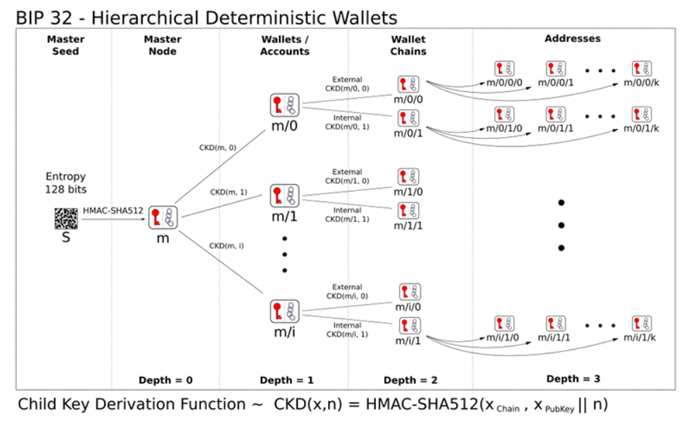
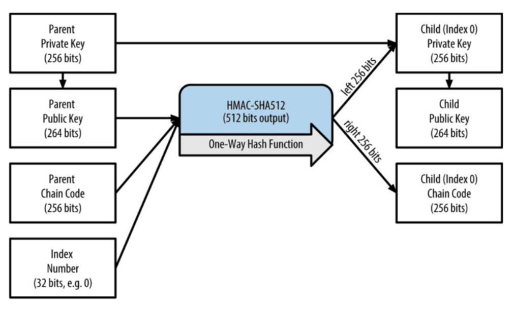
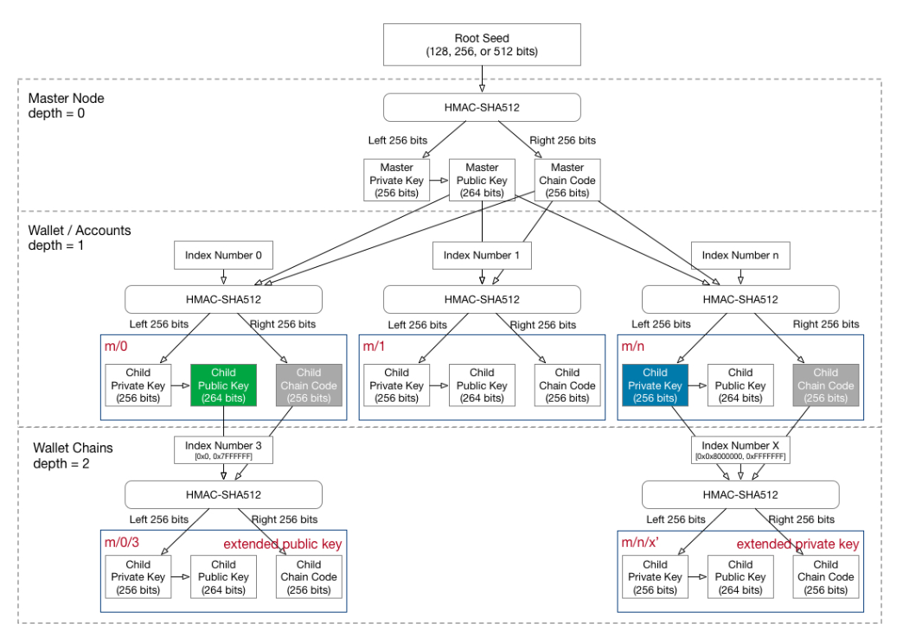
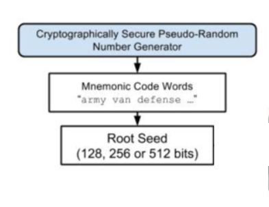

# 分层确定性钱包初探

*Author: [Autosaida](https://github.com/Autosaida); Written: 08/2022*

## 前言

初次使用metamask钱包时，选择创建新账户。在设置密码后，会给出一串英文单词作为助记词，而后**钱包账户**就会成功创建。此时metamask中就会显示一个Account 1，能看到账户对应的地址，也可以输入钱包账户的密码来查看对应的私钥。还可以继续选择create account，此时就会继续生成Account 2、Account 3...每个account也会有对应的地址与私钥。

钱包是如何创建一个个account，其私钥、地址以及助记词之间是什么关系，下面对相关问题进行研究学习。

## 私钥、公钥与地址

有两类以太坊账户可以用来持有和操作以太币：外部账户和合约账户。metamask中创建的一个个地址与私钥就是一个个外部账户。

账户的核心是私钥。私钥用来生成数字签名，所有以太坊交易都要求在链上包含有效的数字签名，故数字签名能够证明对应私钥的所有权，拥有私钥即拥有了对应以太坊地址的控制权。创建账号的关键也即生成一个私钥。 

私钥通过椭圆曲线算法生成公钥，公钥又通过哈希函数生成账户地址。基本过程如下图所示。


私钥 -> 公钥 -> 地址，过程均为不可逆的。

首先随机生成一个私钥（32字节），然后使用私钥通过椭圆曲线算法生成公钥（64字节），最后将公钥哈希得到账户地址（20字节）。

下面逐步说明各个步骤。

### 随机生成私钥

生成私钥的第一步，也是最重要的一步就是找到一个密码学安全的熵，即随机性来源。

私钥为32字节，故实际上就是在0-2<sup>256</sup>之间随机选取一个数值，只要选择的过程不可预测不可重复，那么通过什么方式获得这个数值并不重要。

具体来说，以太坊私钥不能为0，也不能超过一个接近于1.158*10<sup>77</sup>的数字。

故要生成私钥，实质是随机选取一个在上述有效范围内的256位的数值。

### 椭圆曲线算法生成公钥

在椭圆曲线运算中，质数的模乘运算是非常简单的，但是反向的模除运算却是几乎不可能的，这被称为离散对数难题，是以太坊等加密货币数字签名的基础。

公钥正是私钥通过椭圆曲线乘法得来，故只能单向计算，私钥可以算出公钥，但由公钥不能得到私钥。

公钥K = k * G，K为公钥，k为私钥，G为一个生成点。

以太坊使用跟比特币系统相同的椭圆曲线算法，称为secp256k1。使用了该标准定义的一种特殊的椭圆曲线和一系列的数学常量，公钥就是椭圆曲线上的一个满足椭圆曲线等式的(x，y)坐标，由x、y两个数值组成，通过私钥唯一确定。

x、y各32字节，故公钥为64字节，可能会看到65字节表示的公钥，这是由SECG所发布的行业标准的一种序列化编码方式，在最前面加一个字节的前缀，04表示公钥为非压缩格式，即完整存储了x和y的坐标各32字节。但是从secp256k1的椭圆曲线方式可以看到，只要知道其中一个坐标值，另外一个坐标值都是可以通过解方程得出的，因此可以只存储其中一个坐标，这样就可以节约32个字节，从而引入了压缩格式的公钥。如果为压缩格式，则前缀为02或03。

故非压缩格式的公钥65字节（后64字节为实际的公钥），压缩格式的公钥33字节。

### 哈希生成地址

将公钥进行哈希，即可得到地址。

对64字节的完整公钥使用Keccak-256算法来进行哈希，哈希结果的最后20字节即为对应私钥的账户地址。

哈希结果并不区分大小写，但我们可以发现很多地方，如etherscan中的地址是同时存在大小写的。

这是由于[eip-55](https://github.com/ethereum/EIPs/blob/master/EIPS/eip-55.md)引入了checksum机制，通过修改地址中字母的大小写，可以校验地址的准确性，降低用户输入错误地址的风险。

### keystore

keystore文件一般是JSON文件，实质上就是加密后的私钥。故keystore必须用对应密码解密后才能得到私钥，获取账户控制权。即 keystore + 文件密码 = 私钥。

使用keystore可以不用记住复杂的私钥，记住设置的密码即可控制对应的账户。

一般内容如下。

``` json
{
    "address": "df5f03234385f576f8f69e85194a8e02315132f5",
    "id": "e0aa3592-e854-43ed-92ae-2082cd012961",
    "version": 3,
    "crypto": {
        "cipher": "aes-128-ctr",
        "cipherparams": {
            "iv": "caf873134967841a20a2e341fe4f2c16"
        },
        "ciphertext": "ca0cf572f6f5f6e4db7467430ee1b15e25082181a6002cf1d0d954e771b53395",
        "kdf": "scrypt",
        "kdfparams": {
            "dklen": 32,
            "n": 4096,
            "p": 6,
            "r": 8,
            "salt": "a8cc9a642bebe14c32f4e2ed249dd4c30e21379abcccfc3fc0596d7c80b5de2c"
        },
        "mac": "2c529cb3be67518c41a3394fa4054e773449bcc34671389c17e453391ca31413"
    }
}
```

存储了密文、加密算法以及所需的相关参数。

### 代码测试

下面使用代码来根据私钥生成公钥及对应账户地址，并进行验证。使用coincurve库进行椭圆曲线运算，pycryptodome库进行哈希运算。

``` python
import coincurve
from Crypto.Hash import keccak
test_priv = b'\x11'*32
# test_priv = b'\xff'*32
# test_priv = b'\x00'*32
test_pub = coincurve.PublicKey.from_secret(test_priv).format(compressed=False)
print(len(test_pub))
print(test_pub.hex())

test_addr = keccak.new(data = test_pub[1:], digest_bits = 256)
print(test_addr.digest()[-20:].hex())

'''
65
044f355bdcb7cc0af728ef3cceb9615d90684bb5b2ca5f859ab0f0b704075871aa385b6b1b8ead809ca67454d9683fcf2ba03456d6fe2c4abe2b07f0fbdbb2f1c1
19e7e376e7c213b7e7e7e46cc70a5dd086daff2a
'''
```

私钥全0或过大都会报错提示不在范围内，且生成公钥要设置`compressed=False`，不然默认生成压缩格式的公钥。可以看到非压缩格式的公钥为65字节，开头前缀为04，最后将公钥（不带前缀）进行keccak-256哈希运算，结果的最后20字节即为私钥对应的账户地址。

可以用现成的demo对[ethereum-private-key-to-public-key](https://github.com/miguelmota/ethereum-private-key-to-public-key)和[ethereum-private-key-to-address](https://github.com/miguelmota/ethereum-private-key-to-address)对结果进行测试，证明运算无误。

显然这样随意选取的简单的私钥是极不安全的。（但在etherscan中看到甚至还有交易记录）

## BIP32：分层确定性钱包

一个人可能拥有多个账户，因此使用钱包来对多个账户进行管理。一般分为非确定性钱包和确定性钱包。

非确定性钱包（Nodeterministic Wallet）：钱包中的每个密钥都是从不同的随机数独立生成的，密钥彼此之间没有任何关系，这种钱包也被称为JBOK钱包（Just a Bunch Of Keys）。

确定性钱包（Deterministic Wallet）：其中所有的密钥都是从一个主密钥派生出来的，在该类型的钱包中，所有的密钥之间都是相互关联的，只要知道了生成主密钥使用的种子，就可以派生得到全部的密钥；在确定性钱包中，可以使用不同的密钥推导方式。目前最常用的推导方法是树状结构，即分层确定性钱包（Hierarchical Deterministic Wallets），在[BIP32](https://github.com/bitcoin/bips/blob/master/bip-0032.mediawiki)中提出。

显然使用分层确定性钱包，用户只需要记住种子，就可以派生出多个账户来使用，不需要麻烦的备份管理众多账户的私钥。

通过种子生成主密钥，主密钥再逐层推导得到众多的子密钥。基本过程如下。



种子 -> 主密钥 -> 各层子密钥。

首先随机生成一个种子（16-64字节），然后对种子进行哈希生成主密钥和主链码（各32字节），根据密钥和链码使用密钥派生函数即可逐层派生子密钥。

下面结合python模块[bip32](https://github.com/darosior/python-bip32)代码进行说明。

### 种子生成主密钥

由seed可推导出对应的全部子密钥，即一个seed可生成管理一串私钥，故这里seed相当于前面生成单个账户的私钥，需要确保其随机性，长度在16-64字节之间，建议为32字节。

生成足够随机安全的种子后，对其进行HMAC-SHA512哈希，得到64字节的哈希结果，前32字节即为主私钥，可以生成对应的33字节的压缩主公钥。后32字节为主链码，作为熵在后续扩展密钥过程中使用。具体如下图所示。


bip32中的相关代码如下。

``` python
# bip32.py
def from_seed(cls, seed, network="main"):
    """Get a BIP32 "wallet" out of this seed (maybe after BIP39?)

    :param seed: The seed as bytes.
    """
    secret = hmac.new("Bitcoin seed".encode(), seed, hashlib.sha512).digest()
    return BIP32(secret[32:], secret[:32], network=network)

# utils.py
def _privkey_to_pubkey(privkey):
    """Takes a 32 bytes privkey and returns a 33 bytes secp256k1 pubkey"""
    return coincurve.PublicKey.from_secret(privkey).format()
```

方法`from_seed`接受种子seed作为参数，然后对种子进行HMAC-SHA512哈希，前32字节作为主私钥，后32字节作为主链码，来生成BIP32对象。后续调用`_privkey_to_pubkey`函数，使用coincurve库来生成对应的压缩公钥。

有了主私钥（公钥）和主链码，即可派生后续一层层的子密钥。

### 子密钥派生（Child key derivation，CKD）

派生子密钥的方法有两种：父私钥->子密钥，父公钥->子密钥。具体如下图所示。 




即父私钥/公钥+父链码，再加一个索引号，即可调用哈希函数生成子密钥和对应链码。使用父私钥为强化衍生，使用父公钥为常规衍生。强化衍生不会将父级链码暴露到不安全的环境下，所以相较于常规衍生更安全。

为了区分两种不同的派生方案，在索引号也进行了区分，索引号小于2<sup>31</sup>用于常规衍生，而2<sup>31</sup>到2<sup>32-1</sup>用于强化衍生，为了方便表示，索引号 i' 就表示索引号 2<sup>31</sup>+i，如0x80000000表示为0'。

路径m/5/4'表示主密钥的第五个常规衍生的子密钥的第4个强化衍生的子密钥。

由父密钥衍生子密钥可以对密钥树进行深度扩展，使用不同的索引号可以进行水平扩展，从而可以无限的生成私钥，即一个种子生成多个账户。

其中子密钥不能推导出同层级的兄弟密钥，也不能推出父密钥。如果没有子链码也不能推导出孙密钥。

bip32中的相关代码如下。

``` python
# bip32.py
def get_extended_privkey_from_path(self, path):
    """Get an extended privkey from a derivation path.

    :param path: A list of integers (index of each depth) or a string with
                m/x/x'/x notation. (e.g. m/0'/1/2'/2 or m/0H/1/2H/2).
    :return: chaincode (bytes), privkey (bytes)
    """
    if self.privkey is None:
        raise PrivateDerivationError

    if isinstance(path, str):
        path = _deriv_path_str_to_list(path)

    chaincode, privkey = self.chaincode, self.privkey
    for index in path:
        if index & HARDENED_INDEX:
            privkey, chaincode = _derive_hardened_private_child(
                privkey, chaincode, index
            )
        else:
            privkey, chaincode = _derive_unhardened_private_child(
                privkey, chaincode, index
            )

    return chaincode, privkey

# utils.py
def _derive_unhardened_private_child(privkey, chaincode, index):
    """A.k.a CKDpriv, in bip-0032

    :param privkey: The parent's private key, as bytes
    :param chaincode: The parent's chaincode, as bytes
    :param index: The index of the node to derive, as int

    :return: (child_privatekey, child_chaincode)
    """
    assert isinstance(privkey, bytes) and isinstance(chaincode, bytes)
    assert not index & HARDENED_INDEX
    pubkey = _privkey_to_pubkey(privkey)
    # payload is the I from the BIP. Index is 32 bits unsigned int, BE.
    payload = hmac.new(
        chaincode, pubkey + index.to_bytes(4, "big"), hashlib.sha512
    ).digest()
    try:
        child_private = coincurve.PrivateKey(payload[:32]).add(privkey)
    except ValueError:
        raise BIP32DerivationError(
            "Invalid private key at index {}, try the " "next one!".format(index)
        )
    return child_private.secret, payload[32:]


def _derive_hardened_private_child(privkey, chaincode, index):
    """A.k.a CKDpriv, in bip-0032, but the hardened way

    :param privkey: The parent's private key, as bytes
    :param chaincode: The parent's chaincode, as bytes
    :param index: The index of the node to derive, as int

    :return: (child_privatekey, child_chaincode)
    """
    assert isinstance(privkey, bytes) and isinstance(chaincode, bytes)
    assert index & HARDENED_INDEX
    # payload is the I from the BIP. Index is 32 bits unsigned int, BE.
    payload = hmac.new(
        chaincode, b"\x00" + privkey + index.to_bytes(4, "big"), hashlib.sha512
    ).digest()
    try:
        child_private = coincurve.PrivateKey(payload[:32]).add(privkey)
    except ValueError:
        raise BIP32DerivationError(
            "Invalid private key at index {}, try the " "next one!".format(index)
        )
    return child_private.secret, payload[32:]

```

方法`get_extended_privkey_from_path`获取指定路径下的扩展私钥，即BIP32中定义的`CKDpriv`函数，通过父私钥得到子私钥。

使用for循环逐层衍生，其中`HARDENED_INDEX`即0x80000000，用于判断是强化衍生还是常规衍生。`_derive_unhardened_private_child`和`_derive_hardened_private_child`即具体实现了BIP32中定义的[Private parent key → private child key](https://github.com/bitcoin/bips/blob/master/bip-0032.mediawiki#private-parent-key--private-child-key)衍生逻辑。

``` python
# bip32.py
def get_extended_pubkey_from_path(self, path):
    """Get an extended pubkey from a derivation path.

    :param path: A list of integers (index of each depth) or a string with
                    m/x/x'/x notation. (e.g. m/0'/1/2'/2 or m/0H/1/2H/2).
    :return: chaincode (bytes), pubkey (bytes)
    """
    if isinstance(path, str):
        path = _deriv_path_str_to_list(path)

    if _hardened_index_in_path(path) and self.privkey is None:
        raise PrivateDerivationError

    chaincode, key = self.chaincode, self.privkey
    pubkey = self.pubkey
    # We'll need the private key at some point anyway, so let's derive
    # everything from private keys.
    if _hardened_index_in_path(path):
        for index in path:
            if index & HARDENED_INDEX:
                key, chaincode = _derive_hardened_private_child(
                    key, chaincode, index
                )
            else:
                key, chaincode = _derive_unhardened_private_child(
                    key, chaincode, index
                )
            pubkey = _privkey_to_pubkey(key)
    # We won't need private keys for the whole path, so let's only use
    # public key derivation.
    else:
        for index in path:
            pubkey, chaincode = _derive_public_child(pubkey, chaincode, index)

    return chaincode, pubkey

# utils.py
def _derive_public_child(pubkey, chaincode, index):
    """A.k.a CKDpub, in bip-0032.

    :param pubkey: The parent's (compressed) public key, as bytes
    :param chaincode: The parent's chaincode, as bytes
    :param index: The index of the node to derive, as int

    :return: (child_pubkey, child_chaincode)
    """
    assert isinstance(pubkey, bytes) and isinstance(chaincode, bytes)
    assert not index & HARDENED_INDEX
    # payload is the I from the BIP. Index is 32 bits unsigned int, BE.
    payload = hmac.new(
        chaincode, pubkey + index.to_bytes(4, "big"), hashlib.sha512
    ).digest()
    try:
        tmp_pub = coincurve.PublicKey.from_secret(payload[:32])
    except ValueError:
        raise BIP32DerivationError(
            "Invalid private key at index {}, try the " "next one!".format(index)
        )
    parent_pub = coincurve.PublicKey(pubkey)
    try:
        child_pub = coincurve.PublicKey.combine_keys([tmp_pub, parent_pub])
    except ValueError:
        raise BIP32DerivationError(
            "Invalid public key at index {}, try the " "next one!".format(index)
        )
    return child_pub.format(), payload[32:]
```

方法`get_extended_pubkey_from_path`获取指定路径下的扩展公钥，涵盖BIP中定义的`CKDpub`函数，通过父公钥得到子公钥。

首先根据路径判断是否存在强化衍生，如果存在则必须通过私钥来生成公钥，故先得到扩展私钥，再调用`_privkey_to_pubkey`函数生成对应公钥，逐层衍生，最终得到对应路径下的公钥。如果不存在强化衍生，则可以只使用父公钥来得到子公钥，调用`_derive_public_child`函数，具体实现了BIP32中定义的[Public parent key → public child key](https://github.com/bitcoin/bips/blob/master/bip-0032.mediawiki#public-parent-key--public-child-key)衍生逻辑。

整个树状密钥派生结构可如下图表示。



其中右下角为强化衍生，其余均为常规衍生。

### 代码测试

可使用如下代码对BIP32进行测试。

``` python
from bip32 import BIP32
from base58 import *
seed = b'\x11' * 32
bip32 = BIP32.from_seed(seed)
print('master private key:', bip32.get_xpriv())
print('master public key:', bip32.get_xpub())
priv_key = bip32.get_privkey_from_path("m/5/4'")
pub_key = bip32.get_pubkey_from_path("m/5/4'")
print('privkey from m/5/4\':', priv_key.hex())
print('pubkey from m/5/4\':', pub_key.hex())
```

其中主扩展私钥和主扩展公钥的输出分别为xprv和xpub开头的字符串，这是由BIP32定义的[Serialization format](https://github.com/bitcoin/bips/blob/master/bip-0032.mediawiki#serialization-format)。

## BIP39：使用助记词生成确定性钱包

根据BIP32，用户只需要保存一个种子即可控制其对应的一系列账户。但显然一长串的十六进制种子字符串仍旧不是一个很方便的数据，不利于记录且容易记错，因此产生了[BIP39](https://github.com/bitcoin/bips/blob/master/bip-0039.mediawiki)，BIP39提出使用助记词生成确定性钱包，即通过一组便于记忆的单词来生成种子，从而让种子的记忆备份更友好。

BIP39说明了如何生成助记词，以及如何将生成的助记词转化成一个二进制种子。如下图所示。



种子即可直接用于BIP32，生成管理一系列账户。

下面结合python模块[mnemonic](https://github.com/trezor/python-mnemonic)代码进行说明。

### 熵生成助记词

熵生成助记词的基本过程如下图所示。


首先第一步，还是要生成一个密码学安全的熵，即随机性来源，用于生成助记词，因此这个数的选取也要足够随机足够安全。

熵的长度记为ENT，其取值范围为128-256位（16到32字节）。按步长32位，可为[128, 160, 192, 224, 256]（16、20、24、28、32字节）。上图的生成过程就是使用128位的熵。

之后对熵进行SHA256哈希运算，并取出哈希结果的前N位（ENT/32，如：熵长128位，则N = 4）作为熵的校验和（Checksum）。

然后将Checksum添加到熵的尾部，并将该新得到的序列按照11位一段进行分隔，这样对于128位熵长的序列就会生成12段（132/11=12），将每段11位对应的值映射到一个预定义的2048个单词的表中（2<sup>11</sup> = 2048），即可得到一串对应的单词，128位的熵最终得到12个单词。

显然不同熵长有不同的Checksum长度，最终生成的助记词的长度也不同，具体对应关系如下表。

| Entropy(bits) | Checksum(bits) | Entropy+Checksum(bits)	| Mnemonic length(words) |
| :-: | :---: | :---: | :---: |
| 128 | 4 | 132 | 12 |
| 160 | 5 | 165 | 15 |
| 192 | 6 | 198 | 18 |
| 224 | 7 | 231 | 21 |
| 256 | 8 | 264 | 24 |

mnemonic模块的实现代码如下。

``` python
def generate(self, strength: int = 128) -> str:
    if strength not in [128, 160, 192, 224, 256]:
        raise ValueError(
            "Strength should be one of the following [128, 160, 192, 224, 256], but it is not (%d)."
            % strength
        )
    return self.to_mnemonic(os.urandom(strength // 8))
    
def to_mnemonic(self, data: bytes) -> str:
    if len(data) not in [16, 20, 24, 28, 32]:
        raise ValueError(
            "Data length should be one of the following: [16, 20, 24, 28, 32], but it is not (%d)."
            % len(data)
        )
    h = hashlib.sha256(data).hexdigest()
    b = (
        bin(int.from_bytes(data, byteorder="big"))[2:].zfill(len(data) * 8)
        + bin(int(h, 16))[2:].zfill(256)[: len(data) * 8 // 32]
    )
    result = []
    for i in range(len(b) // 11):
        idx = int(b[i * 11 : (i + 1) * 11], 2)
        result.append(self.wordlist[idx])
    if self.language == "japanese":  # Japanese must be joined by ideographic space.
        result_phrase = u"\u3000".join(result)
    else:
        result_phrase = " ".join(result)
    return result_phrase
```

方法`generate`随机生成一组助记词，使用`os.urandom()`来生成熵，且限定了熵长为[128, 160, 192, 224, 256]。

之后调用`to_mnemonic`方法根据随机熵生成助记词，实现与前面的描述一致。

### 助记词生成种子

助记词生成种子的基本过程如下图所示。


主要使用密钥拉伸（Key stretching）算法PBKDF2来生成种子。

PBKDF2基本原理是通过一个为随机函数（如这里使用的HMAC-SHA512），把助记词明文和盐值作为输入参数，然后重复进行多次运算（这里2048轮），最终产生生成一个更长的（512位）密钥种子。

密钥拉伸函数需要两个参数：助记词和盐（salt）。盐可以提高暴力破解的难度。盐由常量字符串"mnemonic"及一个可选的密码组成，不设置密码则salt就为"mnemonic"。若使用了不同的密码，则同一组助记词通过密钥拉伸函数会得到不同的种子。

这里盐值中设置的密码可以作为一个额外的安全因子来保护种子，即使助记词的备份被窃取，也可以保证钱包的安全。（当然你也要记得自己加了怎样的盐）

mnemonic模块的实现代码如下。

``` python
def to_seed(cls, mnemonic: str, passphrase: str = "") -> bytes:
    mnemonic = cls.normalize_string(mnemonic)
    passphrase = cls.normalize_string(passphrase)
    passphrase = "mnemonic" + passphrase
    mnemonic_bytes = mnemonic.encode("utf-8")
    passphrase_bytes = passphrase.encode("utf-8")
    stretched = hashlib.pbkdf2_hmac(
        "sha512", mnemonic_bytes, passphrase_bytes, PBKDF2_ROUNDS
    )
    return stretched[:64]
```

方法`to_seed`根据助记词生成种子。可以看到使用的salt为"mnemonic"+passphrase，密码默认为空，最后调用pbkdf2函数生成64字节（512位）的种子。

### 代码测试

使用如下代码对BIP32及BIP39进行测试。

``` python
from mnemonic import Mnemonic
from bip32 import BIP32

mnemo = Mnemonic("english")
words = mnemo.generate(strength = 256)
print('mnemonic:', words)
seed = mnemo.to_seed(words, passphrase="")
print('seed:', seed.hex())

master_key = mnemo.to_hd_master_key(seed)
print('master_key from mnemo:', master_key)

bip32 = BIP32.from_seed(seed)
priv_key = bip32.get_xpriv_from_path("m/5/4'")
pub_key = bip32.get_xpub_from_path("m/5/4'")
print('xpriv from m/5/4\':', priv_key)
print('xpub from m/5/4\':', pub_key)
'''
mnemonic: find wool wrestle thought head shoe mobile among find top eager sniff depart zero combine about else later gaze stay journey depth shaft coil
seed: 963f67803815c1c97784dda18260f467e01e58b6d39171357c124fb1e2130487a94869f0b66298346a6c894797bb6bd988cf76e2bc2b85dc9dbcf0c0603116cf
master_key from mnemo: xprv9s21ZrQH143K34L3cV5waZgj6FN9KznoPbNYzRJxcjMvWjZomTJN2JcJcThXK37wriXYsaxqZMVyCsfypR9AbFMZYw4p2rFRbjvEKqLfQay
xpriv from m/5/4': xprv9wcQaJMMuBa2wJ33Z1Tg3HAqUE1WFYDxG5bsvuTMN1HBtLMkaVKd5U8SLz5QC4Z6kGNDEhLRKs9yhRYpLHnjmsfNeYbUteM5F1EH3oEdrjK
xpub from m/5/4': xpub6AbkyotFjZ8L9n7Wf2zgQR7a2FqzezwodJXUjHrxvLpAm8gu82dsdGSvCHvVVJ4YC2B94L7xTgvcZLnSRQdJu7R9JscZxUZuKYfcAq1YXuU
'''
```

可使用[在线助记词转换器](https://iancoleman.io/bip39/#english)对结果进行检查.


结果无误。

## BIP44：确定性钱包的多账户层次结构

根据BIP32，在密钥树状结构中，每个子密钥都有自己的路径，但并没有明确规定每个路径的具体使用途径，使得钱包开发者可以自定义自己的节点结构，这就很容易导致没有办法100%保证使用了HD钱包A的用户将自己的助记词/种子导入到HD钱包B中还能正常工作；也没有办法保证HD钱包支持多个链的私钥管理。

由此产生了[BI433](https://github.com/bitcoin/bips/blob/master/bip-0043.mediawiki)和[BIP44](https://github.com/bitcoin/bips/blob/master/bip-0044.mediawiki)，提出确定性钱包的多账户层次结构，对BIP32的子节点派生路径的模式、每段的含义做出具体的规定，同时也扩展了对多币种的支持。

事实上现如今的HD钱包都遵循了BIP32和BIP44的规定，也只有遵循了这两个规范的钱包应用才是大概率完全兼容的。

### 路径级别

BIP44指定了包含5个预定义树状层级的结构：
```
m / purpose' / coin_type' / account' / change / address_index
```

m是固定的，purpose也是固定的，值为44（44'即0x8000002C），代表遵循BIP44。

coin_type代表的是币种，0代表比特币，1代表比特币测试链，60代表以太坊，完整的币种列表可见[slip44](https://github.com/satoshilabs/slips/blob/master/slip-0044.md)。

account将密钥空间拆分为独立的用户身份，可自主用于不同的功能，如专门用于储蓄的账户，专门用于捐赠的账户。

change值为常量0或1。常量0用于外部链，常量1用于内部链。外部链用于在钱包之外可见的地址（例如用于接收付款）。内部链用于在钱包之外不可见的地址，并用于返回交易更改。因此一般为0。

address_index就是地址索引，从0开始，代表生成第几个地址。

以太坊钱包也同样遵循BIP44，路径为m/44'/60'/a'/0/n，其中60即为以太币对应的coin_type，a表示帐号，n表示生成的第n个地址。

### 代码测试

使用如下代码进行测试，根据助记词输出以太坊对应路径的账户地址。

``` python
from mnemonic import Mnemonic
from bip32 import BIP32
import coincurve
from Crypto.Hash import keccak

words = 'your mnemonic'
def get_addr_by_path(path):
    global words
    mnemo = Mnemonic("english")
    seed = mnemo.to_seed(words, passphrase="")
    bip32 = BIP32.from_seed(seed)
    privkey = bip32.get_privkey_from_path(path)
    pubkey = coincurve.PublicKey.from_secret(privkey).format(compressed=False)
    addr = keccak.new(data = pubkey[1:], digest_bits = 256)
    return addr.digest()[-20:].hex()

print(get_addr_by_path("m/44'/60'/0'/0/0"))
print(get_addr_by_path("m/44'/60'/0'/0/1"))
```

将输出结果与metamask钱包中的地址进行比较，可以看出钱包中生成的第一个账户路径就是`m/44'/60'/0'/0/0`，第二个就是`m/44'/60'/0'/0/1`，以此类推。

## 总结

回顾一下发展过程，为了避免管理多个账户，出现了BIP32分层确定性钱包，从而可以从一个种子生成管理无限的账户，而种子并不方便，因此出现了BIP39，可以从助记词生成种子，继而生成分层确定性钱包，更加便利，而BIP32并没有明确规定生成的树状密钥层次结构各层的具体用途，因此可能导致各钱包实现不同，也无法支持多币种，因此出现了BIP44，给树状密钥结构的路径赋予了明确的意义，也解决了多币种问题。

整个流程基本如下图所示。


最后区分一下密码的概念，助记词生成种子使用的密码passphrase用作PBKDF2算法的盐，可以有也可以没有，目前主流钱包的助记词是无密码的；keystore的密码是用于解密加密文件得到私钥的；metamask创建时输入的密码是钱包密码，用于解密存储在本地的助记词等关键数据，类似于keystore的密码。


## 参考链接

[详解私钥、密码、keystore和助记词](https://blog.csdn.net/pulong0748/article/details/109022685)

[ETH钱包助记词、私钥、Keystore创建原理](https://www.jianshu.com/p/84c7dcf3098a)

[区块链开发之确定性算法bip32，bip39，bip44](https://blog.csdn.net/weixin_39842528/article/details/82224907)

[精通以太坊4：以太坊背后的密码学](https://blog.csdn.net/tlkj6868xds/article/details/105164619)

[比特币：账户私钥、公钥、地址的生成](https://www.cnblogs.com/kumata/p/10477369.html)

[理解开发HD 钱包涉及的 BIP32、BIP44、BIP39](https://learnblockchain.cn/2018/09/28/hdwallet)

[比特币钱包(3) BIP32 HD钱包之密钥树](https://blog.csdn.net/thefist11cc/article/details/114480937)

[基于BIP-32和BIP-39规范生成HD钱包](https://stevenocean.github.io/2018/09/23/generate-hd-wallet-by-bip39.html)

[分层确定性钱包 HD Wallet 剖析：设计和实现](https://www.arcblock.io/blog/zh/post/2018/12/01/hd-wallets-design-and-implementation)

[以太坊账户管理之keystore文件](https://stevenocean.github.io/2018/04/02/about-ethereum-keystore.html)

[Understanding BIP39 and Your Mnemonic Phrase](https://privacypros.io/wallets/mnemonic-phrase)