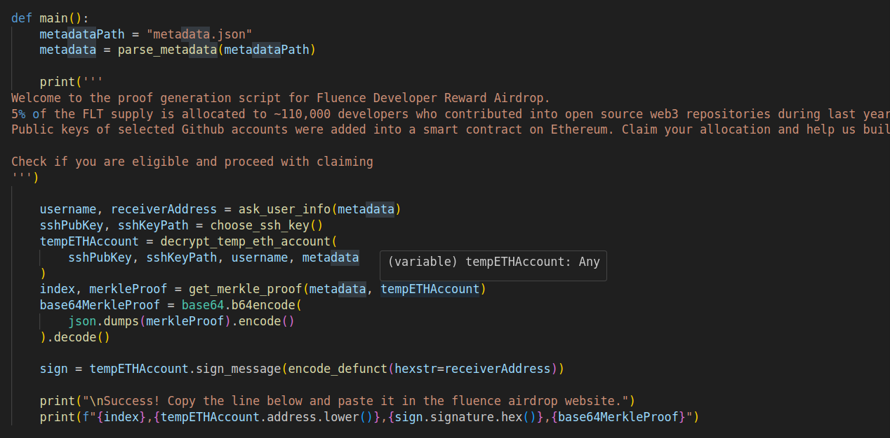
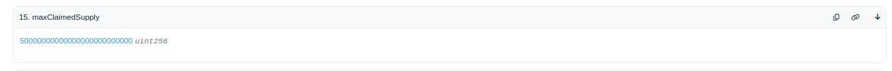
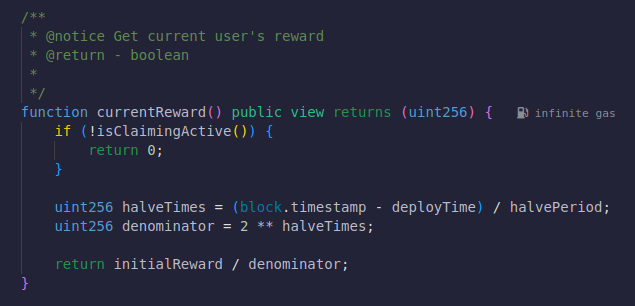

# 前言

前一段时间 [Fluence](https://fluence.network/) 开启针对 Github 开发者的空投活动，对符合要求的开发者空投 5000 枚 FLT，最高价格近 8000 美元（2024.5.15 约 2400 美元）。特别的是，领取该空投需要用户在本地运行一段代码，将执行结果复制到官网才能领取，并且锁仓 2 个月。笔者非常好奇，这种领取方式是否存在安全风险，因此展开了代码分析。

# 疑问

这是一条领取的交易记录：[🔗](https://etherscan.io/tx/0x7762bc734a7dba69c4f3744b37ac8215f8c9ae8ce7071de9ed08060ef88409f8)，我们的问题如下：

1. 官方是怎么用智能合约 solidity 验证你是 github ssh key 的拥有者的？

2. 怎么查询领取进度？

3. 领取交易会不会泄露你的evm领取地址与github的关联？

4. 合约中用到了哪些省 gas 的方案？

# 前置知识

1. [🔗](https://soliditydeveloper.com/merkle-tree)，翻译：[🔗](https://learnblockchain.cn/article/5297)：了解 Merkle.verify 以及 bitmap 省 gas 的方法
2. `https://github.com/<username>.keys`：查询别人的 ssh 公钥

# 领取逻辑

项目方事先获取到所有开发者的公钥并给他们分配一个 user_id 和 temp_eth_account，然后使用开发者的公钥对 temp_eth_account 的私钥加密成 data。将所有的 temp_eth_account （以及 user_id）组成一个 Merkle Tree，将 Merkle Tree Root 放在合约里。因此用户要提供验证

用户用自己的私钥解密 data 得到 temp_eth_account 的私钥（从而得到这个 temp_eth_account 的控制权，这个 temp_eth_account 的地址是所有人都知道的）和 user_id，然后得到对应 Merkle Proof。然后用 temp_eth_account 签名一条信息：把钱发给 receiverAddress。最后把 user_id，temp_eth_account，MerkleProof 都发到合约 claim 函数里。

合约会校验 temp_eth_account 是否是最初项目方分配的（其实就是用 Merkle Proof 来证明 github_address 是最初那个 List 里的一个，但是保存所有 github_address 太占空间，所以只保存了 Root）然后验证签名来证明用户有控制权，一旦证明有控制权就发空投。

## 前端

仓库：[🔗](https://github.com/fluencelabs/dev-rewards.git)

1. ask_user_info 就是让用户输入自己的 github 名字和 receiverAddress，判断 github 名是否在列表中

2. choose_ssh_key 是让用户选择自己的私钥地址（不会上网所以不用担心）

3. decrypt_temp_eth_account 通过私钥解密 data 得到 temp_eth_account 的控制权

4. get_merkle_proof 得到 Merkle Proof 和 user_id

5. 用 temp_eth_account 来签名：把钱发给 receiverAddress

6. 获得 user_id、temp_eth_address、sign、Merkle Proof。将这串输出复制到去执行合约的 claimToken 函数。

## 合约

1. Merkle.verify 验证 temp_eth_account 是否是项目方最先发放的

2. 验证签名是否来自 temp_eth_account

3. 发钱

# 相关问题

## 如何查询领取进度（甚至会随时间减半）

当前已领取：

总供应：

甚至代码里领取量随时间是一直减半的：

## 领取交易会不会泄露你的evm领取地址与github的关联？

不会泄露。所有人只能看到：

1. github 用户的公钥

2. 被 github 用户公钥加密过的 temp_eth_address 的私钥，即 data

3. temp_eth_address

4. receiverAddress

上面 2 中的 data 无法通过 github 用户的公开信息（公钥）求出 temp_eth_address，因此没有办法建立temp_eth_address 和 github 的关联，从而无法建立 receiverAddress 和 github 的关联。

## 人家用到了哪些省gas的方案

合约中使用 bitmap 来存储用户是否领取的状态，以此来节省空间。
